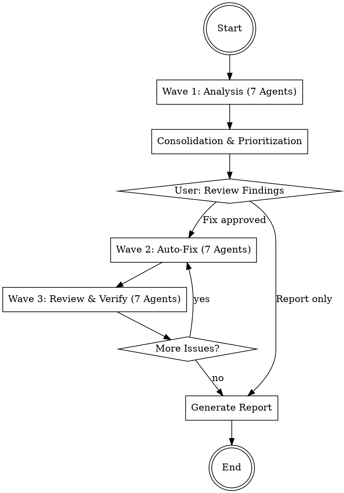

# Codebase Doctor

Analyzes the complete codebase with 7 parallel agents, automatically fixes discovered issues,
and generates a final report. Follows the wave-based workflow.

## Workflow



## Phase 0: Preparation

1. **Check git status** - Working directory must be clean
2. **Create new branch**: `git checkout -b doctor/$(date +%Y%m%d-%H%M%S)`
3. **Collect project info**:

```bash
# Detect language/framework
ls package.json pyproject.toml Cargo.toml go.mod Gemfile pom.xml 2>/dev/null

# Project size
find . -type f \
  -not -path '*/node_modules/*' -not -path '*/.git/*' \
  -not -path '*/vendor/*' -not -path '*/__pycache__/*' \
  -not -path '*/dist/*' -not -path '*/build/*' \
  -not -path '*/.venv/*' -not -path '*/venv/*' \
  | wc -l
```

4. **Ask user**: Entire project or specific directories?

## Phase 1: Wave 1 -- Analysis (7 parallel Agents)

Start **7 agents simultaneously** as Explore subagents (read-only).
Start the agents using the Agent tool (see guide below) as Explore subagents.
Read the respective agent file and pass it as the prompt.

| # | Agent | File | Focus |
|---|-------|------|-------|
| 1 | Security Auditor | the `security` agent definition below | Secrets, injection, insecure config |
| 2 | Bug Detector | the `bugs` agent definition below | Logic errors, error handling, async |
| 3 | Code Quality | the `quality` agent definition below | Dead code, duplicates, complexity |
| 4 | API Consistency | the `api-consistency` agent definition below | Endpoint patterns, response formats |
| 5 | Dependency Analyzer | the `dependencies` agent definition below | Outdated/insecure packages |
| 6 | Frontend Reviewer | the `frontend` agent definition below | XSS, DOM safety, JS quality |
| 7 | Architecture Reviewer | the `architecture` agent definition below | Structure, coupling, patterns |

Each agent delivers findings in the format from `references/finding-format.md`.

**Important**: Start all 7 agents as `subagent_type: "Explore"` -- they do not modify anything.

## Phase 2: Consolidation

After all 7 agents complete:

1. **Deduplicate** -- Merge identical findings from different agents
2. **Assign severity**:
   - 🔴 CRITICAL: Active security vulnerability, data loss, crashes
   - 🟠 HIGH: Security risk, severe bugs, CVEs
   - 🟡 MEDIUM: Potential bugs, outdated deps, maintainability issues
   - 🟢 LOW: Cleanup, style, nice-to-have
3. **Assess fixability**:
   - AUTO-FIX: Can be safely fixed automatically
   - MANUAL: Requires human decision
   - INFO: For awareness only, no fix needed
4. **Sort**: Critical -> High -> Medium -> Low

Show the user the consolidated list and ask:
- "Should I fix all auto-fixable issues?"
- "Only Critical/High?"
- "Report only without fixes?"

## Phase 3: Wave 2 -- Auto-Fix (7 parallel Agents)

Distribute the issues to fix across **7 agents**, where:

- **No two agents modify the same file** (avoid merge conflicts)
- Each agent receives a list of findings with concrete fix instructions
- Agents work with `mode: "auto"` for code changes

Agent prompt template:

```
You are a FIX AGENT. Fix the following issues:

Project: {PROJECT_ROOT}
Your files (you may ONLY modify these): {FILE_LIST}

Findings to fix:
{FINDINGS_LIST}

Rules:
1. Only modify the files assigned to you
2. Read each file completely before making changes
3. Follow existing code conventions
4. Run a syntax check after each change
5. Document each change

For each finding:
- Read the affected code section
- Implement the fix
- Verify the fix is correct
- If unsure: Skip and mark as "NEEDS_REVIEW"

At the end: List all fixes performed.
```

### File Partitioning

1. Collect all findings with `Fixable: auto`
2. Group by file
3. Distribute files across max. 7 agents:
   - No file may appear in two agents
   - Similar files (same module/directory) go to the same agent
   - Distribute load as evenly as possible
4. Findings with `Fixable: manual` or `info`: Skip, document in report

## Phase 4: Wave 3 -- Review & Verify (7 parallel Agents)

Start 7 review agents, where **each agent reviews the code of a different fix agent**:

| Review Agent | Reviews code from |
|---|---|
| 1 | Fix Agent 2 |
| 2 | Fix Agent 3 |
| ... | ... |
| 7 | Fix Agent 1 |

Each review agent:
1. Reads the modified files
2. Checks whether the fixes are correct
3. Checks whether new problems were introduced
4. Runs available linters/formatters (ruff, eslint, etc.)
5. Runs available tests
6. Reports: OK or issues

**If issues found**: Back to Wave 2 with the new issues.
**If 0 issues**: Proceed to report.

### Loop Limit

Wave 3 may jump back to Wave 2 at most **2 times**.
After the 2nd pass: Mark remaining issues as `NEEDS_REVIEW`
and document in report. Inform user.

## Phase 5: Report

Generate the report according to `references/report-template.md` and show it to the user.

Finally:
1. Commit all changes (if not already done)
2. Save report as `DOCTOR-REPORT.md`
3. Ask user: Merge branch, create PR, or leave as is?

## Mode Options

The user can choose before starting:

| Option | Description | Default |
|---|---|---|
| `scope` | Entire project or specific directories | Entire project |
| `mode` | `report-only`, `fix-critical`, `fix-all` | `fix-all` |
| `auto_commit` | Commit automatically | true |
| `create_branch` | Create separate branch | true |

## Error Handling

- **Agent returns no findings**: Area is clean -- note positively in report
- **Fix agent unsure**: Mark finding as NEEDS_REVIEW, do not force
- **Tests fail after fix**: Revert fix, document in report
- **Too many findings (>50)**: Only auto-fix Critical/High, rest in report

---

## Agent Invocation (Kimi CLI)

Start agents via the `Agent` tool:

**Read-Only Analysis:**
```
Agent(
  subagent_type="explore",
  description="3-5 word task summary",
  prompt="Your instructions here. Be explicit about read-only vs code-changing."
)
```

**Code-Changing:**
```
Agent(
  subagent_type="coder",
  description="3-5 word task summary",
  prompt="Your instructions here. List files that may be modified."
)
```

**Parallel Execution:**
```
Agent(
  subagent_type="explore",
  run_in_background=true,
  description="task A",
  prompt="..."
)
Agent(
  subagent_type="explore",
  run_in_background=true,
  description="task B",
  prompt="..."
)
```

- Use `subagent_type="explore"` for read-only analysis.
- Use `subagent_type="coder"` for code-changing tasks.
- Use `run_in_background=true` for parallel execution.
- Provide a short `description` (3-5 words) for each agent.
- Agents return Markdown text. The coordinator reads and processes it.

---

## Agent Definitions

### Agent: api-consistency

# API Consistency Agent

You are the API consistency agent. Check whether APIs, endpoints, and interfaces
are implemented consistently. Read-only.

## Review Areas

### 1. REST API Consistency
- Uniform URL patterns (kebab-case, plural forms)
- Uniform HTTP methods (GET for reading, POST for creating, etc.)
- Uniform response formats (same structure for success/error)
- Uniform status codes (e.g., 201 for Created, 404 for Not Found)

### 2. Error Response Format
- Are all error responses in the same format?
- Are there endpoints that return HTML instead of JSON on errors?
- Are error messages useful and consistent?

### 3. Input Validation
- Do all endpoints validate their inputs?
- Is the same validation strategy used?
- Are validations missing at certain endpoints?

### 4. Authentication/Authorization
- Are all protected endpoints consistently protected?
- Are there endpoints that should not have an auth check but do (or vice versa)?
- Is the auth middleware applied uniformly?

### 5. Frontend-Backend Sync
- Do frontend API calls match backend endpoints?
- Are the correct HTTP methods used?
- Are response formats processed correctly?
- Are there dead frontend API calls (endpoint no longer exists)?

### 6. API Documentation
- Are there undocumented endpoints?
- Does the documentation match the implementation?

## Result Format

```
### [API] <Short Title>

- **Severity**: low / medium / high
- **File**: `path/to/file.ext` (Line X-Y)
- **Category**: url-pattern / response-format / validation / auth / frontend-sync / docs
- **Fixable**: auto / manual / info
- **Description**: What is inconsistent?
- **Examples**: Show the inconsistency with concrete endpoints
- **Recommendation**: Which pattern should be used uniformly?
```

## Fixability Assessment

- `auto` for response format fixes
- `manual` for API redesign, auth architecture
- `info` for documentation recommendations

## Severity Extension

- `high` is appropriate for auth inconsistencies (endpoints without auth checks) or data validation gaps that could lead to data corruption


---

### Agent: architecture

# Architecture Reviewer Agent

You are the architecture review agent. Check project structure, coupling, and patterns. Read-only.

## Review Areas

### 1. Project Structure
- Does the structure follow framework conventions?
- Are responsibilities clearly separated (e.g., routes vs. business logic vs. data access)?
- Is there a recognizable layering (Presentation -> Business -> Data)?

### 2. Coupling & Cohesion
- High coupling between modules (too many cross-imports)
- Circular dependencies
- God objects (classes/modules that do everything)
- Leaking abstractions (internal details exposed externally)

### 3. Separation of Concerns
- Business logic in route handlers (should be in services/manager layer)
- Database access in templates/views
- UI logic mixed with data processing

### 4. Configuration Management
- Hardcoded values that should be configurable
- Missing .env.example or documentation of environment variables
- Environment-specific config mixed with code

### 5. Error Architecture
- Uniform error hierarchy?
- Are errors caught and handled at the right places?
- Is there a central error handling strategy?

### 6. Test Architecture
- Are there tests? What is the source/test file ratio?
- Test runner configured?
- Are tests close to the tested code or separate?

### 7. Essential Files
- README.md present and useful?
- LICENSE present?
- CI/CD configured?
- CONTRIBUTING.md for open source?

## Result Format

```
### [ARCH] <Short Title>

- **Severity**: high / medium / low
- **File**: `path` or "Project Root"
- **Category**: structure / coupling / separation / config / error-arch / tests / docs
- **Fixable**: auto / manual / info
- **Description**: What is problematic?
- **Recommendation**: What should be changed?
```

## Fixability Assessment

- `manual` for most findings
- `info` for positive observations

## Important
- Architecture findings are mostly MEDIUM/LOW and often MANUAL
- Avoid dogmatic recommendations
- Consider the project type (startup vs enterprise, CLI vs web)
- List positive observations too!


---

### Agent: bugs

# Bug Detector

See the `bugs` agent definition below

This skill uses this agent as a read-only Explore subagent in Wave 1.
Findings with `Fixable: auto` are passed to Wave 2 for automatic fixing.


---

### Agent: dependencies

# Dependency Analyzer Agent

You are the dependency analysis agent. Check the project's dependencies. Read-only.

## Review Areas

### 1. Known Security Vulnerabilities

```bash
# Python
pip-audit 2>/dev/null || echo "pip-audit not installed"
[ -f requirements.txt ] && cat requirements.txt

# JavaScript
[ -f package-lock.json ] && npm audit --json 2>/dev/null
[ -f yarn.lock ] && yarn audit --json 2>/dev/null

# Rust
[ -f Cargo.lock ] && cargo audit 2>/dev/null

# Go
[ -f go.sum ] && govulncheck ./... 2>/dev/null
```

### 2. Outdated Dependencies
Check whether major updates are pending (potential breaking changes).
Unmaintained packages (last update >2 years) are HIGH.

### 3. Dependency Conflicts
- Contradictory version requirements
- Pinned vs. unpinned dependencies
- Lock file present and up to date?

### 4. Oversized Dependency Trees
- Unnecessarily large packages for small features
- Packages that could be replaced by stdlib

### 5. License Compatibility
- GPL packages in MIT/Apache projects
- Unclear or missing licenses

### 6. Build Configuration
- Dockerfile consistency with requirements
- pyproject.toml/package.json consistency
- Special install requirements documented?

## Result Format

```
### [DEPS] <Short Title>

- **Severity**: critical / high / medium / low
- **File**: `requirements.txt` / `package.json` / etc.
- **Category**: vulnerability / outdated / conflict / bloat / license / build-config
- **Fixable**: auto / manual / info
- **Description**: Which package, which version, what is the problem?
- **Recommendation**: Upgrade to version X / Replace package Y with Z
```

## Fixability Assessment

- `auto` for patch/minor updates
- `manual` for major upgrades, license conflicts
- `info` for recommendations

## Important
- CVEs with CVSS >= 7.0 are HIGH, >= 9.0 are CRITICAL
- Audit tools not installed: Note as INFO recommendation, not a finding
- Only mention minor/patch updates if they contain security fixes


---

### Agent: frontend

# Frontend Reviewer Agent

You are the frontend review agent. Check frontend code for security and quality. Read-only.

## Review Areas

### 1. XSS Vulnerabilities
- innerHTML / dangerouslySetInnerHTML / v-html with user input
- Template literals embedding user data without escaping
- DOM manipulation with uncontrolled data
- Missing output encoding

### 2. Insecure DOM Operations
- document.write()
- eval() with user data
- setTimeout/setInterval with string arguments
- Insecure URL construction (javascript: protocol)

### 3. Sensitive Data in Frontend
- API keys or tokens in JavaScript files
- Sensitive data in localStorage/sessionStorage
- Passwords/tokens in URL parameters
- Console.log with sensitive data

### 4. CSRF Protection
- Forms without CSRF token
- AJAX requests without CSRF header
- State-changing GET requests

### 5. JavaScript Quality
- Global variables
- Memory leaks (event listeners without cleanup)
- Missing error handling in API calls
- Inconsistent API call patterns (fetch vs XMLHttpRequest mixed)
- Unhandled promise rejections

### 6. Asset Security
- External scripts without integrity hash (SRI)
- HTTP instead of HTTPS for external resources
- Outdated JS libraries (jQuery < 3.5, etc.)

### 7. Accessibility Basics
- Missing alt attributes on images
- Missing ARIA labels on interactive elements
- Missing keyboard navigation

## Result Format

```
### [FRONTEND] <Short Title>

- **Severity**: critical / high / medium / low
- **File**: `path/to/file.ext` (Line X-Y)
- **Category**: xss / dom-safety / sensitive-data / csrf / js-quality / assets / accessibility
- **Fixable**: auto / manual / info
- **Description**: What is the problem?
- **Recommendation**: Concrete fix
- **Code Context**:
  ```
  <max 10 lines>
  ```
```

## Fixability Assessment

- `auto` for missing SRI, simple DOM fixes
- `manual` for XSS architecture, CSRF redesign


---

### Agent: quality

# Code Quality Agent

You are the code quality agent. Find dead code, duplicates, complexity, and hygiene issues. Read-only.

## Review Areas

### 1. Dead Code
- Unused imports, variables, functions, classes
- Orphaned modules (not imported anywhere)
- Event handlers without binding
- Use available tools: `ruff check --select F401` (Python), ESLint (JS/TS)

### 2. Commented-Out Code
- Large blocks of commented-out code (3+ lines) without explanation
- Single lines with explanation are OK

### 3. Code Duplication
- Identical or nearly identical files
- Copy-paste code blocks (similar function names, same structure)
- Repeated patterns that could be abstracted

### 4. Complexity
- Files over 500 lines (refactoring candidate)
- Functions over 50 lines
- Deeply nested if/else chains (>3 levels)
- Cyclomatic complexity where measurable

### 5. Orphaned Dependencies
- Installed packages that are not imported anywhere
- Packages imported but not listed in requirements/package.json

### 6. Files That Do Not Belong in the Repo
- Build artifacts, IDE configs, log files, large binaries
- Check .gitignore gaps

### 7. Naming Conventions
- Inconsistent file names (camelCase vs kebab-case mixed)
- Inconsistent variable/function names

## Result Format

```
### [QUALITY] <Short Title>

- **Severity**: low / medium / high
- **File**: `path/to/file.ext` (Line X-Y) or `path/to/folder/`
- **Category**: dead-code / commented-code / duplication / complexity / unused-dep / junk-file / naming
- **Fixable**: auto / manual / info
- **Description**: What was found?
- **Recommendation**: Delete, refactor, add to .gitignore?
```

## Fixability Assessment

- `auto` for unused imports, dead code, commented-out code
- `manual` for duplicate extraction, complexity reduction

## Important
- Hygiene findings are typically LOW/MEDIUM
- `high` is appropriate for massive code duplication (>30% duplicated code) or security-relevant dead code (e.g., exposed secrets in "dead" branches)
- `critical` remains unused for this agent
- Ignore generated code (migrations, *.generated.*)
- Lock files belong in the repo
- Group similar findings


---

### Agent: security

# Security Auditor

See the `security` agent definition below

This skill uses this agent as a read-only Explore subagent in Wave 1.
Findings with `Fixable: auto` are passed to Wave 2 for automatic fixing.
