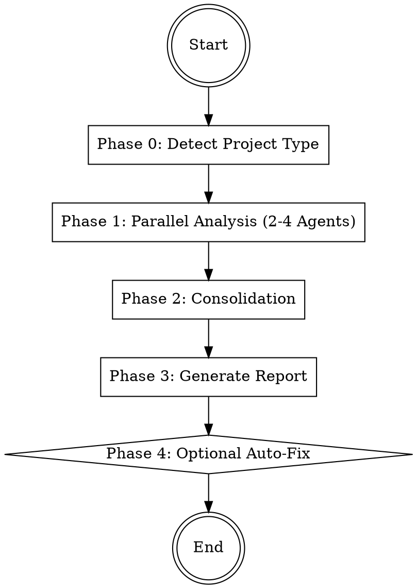

# Performance Analyzer

Analyzes the codebase for performance bottlenecks with up to 4 parallel agents, consolidates
findings by impact, and generates a structured performance report.

## Workflow



## Phase 0: Preparation

1. **Detect project type** by checking for key files:

```bash
# Frontend indicators
ls package.json next.config.* vite.config.* webpack.config.* angular.json 2>/dev/null

# Backend indicators
ls go.mod Cargo.toml pyproject.toml requirements.txt Gemfile pom.xml 2>/dev/null

# Database/ORM indicators
grep -rl "prisma\|sequelize\|typeorm\|sqlalchemy\|django.db\|ActiveRecord\|gorm\|diesel" --include="*.json" --include="*.toml" --include="*.txt" --include="*.rb" --include="*.go" . 2>/dev/null | head -5
```

2. **Classify** as `frontend`, `backend`, or `fullstack`
3. **Determine which agents to run**:
   - Bundle Analyzer: only if frontend or fullstack (package.json + frontend framework detected)
   - Query Analyzer: only if database/ORM detected
   - Runtime Analyzer: always
   - Infra Reviewer: always

## Phase 1: Parallel Analysis (2-4 Agents)

Start agents simultaneously as Explore subagents (read-only).
Use the Agent tool.

| # | Agent | File | Condition |
|---|-------|------|-----------|
| 1 | Bundle Analyzer | the `bundle-analyzer` agent definition below | Frontend or fullstack only |
| 2 | Query Analyzer | the `query-analyzer` agent definition below | Database/ORM detected only |
| 3 | Runtime Analyzer | the `runtime-analyzer` agent definition below | Always |
| 4 | Infra Reviewer | the `infra-reviewer` agent definition below | Always |

Pass each agent the detected project type and framework as context.

**Important**: All agents run as `subagent_type: "Explore"` -- they do not modify anything.

## Phase 2: Consolidation

After all agents complete:

1. **Deduplicate** -- Merge identical or overlapping findings from different agents
2. **Assign impact**:
   - **High**: User-visible latency, page load > 3s, query > 1s, bundle > 500KB unnecessary
   - **Medium**: Server-side inefficiency, suboptimal patterns, moderate waste
   - **Low**: Marginal improvement, cleanup, best-practice alignment
3. **Sort** by impact: High -> Medium -> Low
4. **Estimate savings** where possible (KB for bundle, ms for queries, complexity reduction)

## Phase 3: Generate Report

Generate `PERFORMANCE-REPORT.md` using the template from `references/report-template.md`.

Include:
- Executive summary with overall health assessment
- All findings grouped by impact level
- Quick wins section (easiest fixes with highest impact)
- Skipped analyses with reasons

Present the report to the user.

## Phase 4: Optional Auto-Fix

Ask the user:
- "Should I fix specific findings? Name the ones you want addressed."
- "Should I fix all quick wins?"
- "Report only, no changes?"

If fixes requested, create a new branch and apply changes using code-changing agents
with explicit file lists.

## Error Handling

- **Agent returns no findings**: Note positively in report ("No issues found in this area")
- **Agent skipped**: Document in "Skipped Analyses" section with reason
- **Agent timeout**: Inform user which area was not analyzed, continue with remaining results

---

## Agent Invocation (Kimi CLI)

Start agents via the `Agent` tool:

**Read-Only Analysis:**
```
Agent(
  subagent_type="explore",
  description="3-5 word task summary",
  prompt="Your instructions here. Be explicit about read-only vs code-changing."
)
```

**Code-Changing:**
```
Agent(
  subagent_type="coder",
  description="3-5 word task summary",
  prompt="Your instructions here. List files that may be modified."
)
```

**Parallel Execution:**
```
Agent(
  subagent_type="explore",
  run_in_background=true,
  description="task A",
  prompt="..."
)
Agent(
  subagent_type="explore",
  run_in_background=true,
  description="task B",
  prompt="..."
)
```

- Use `subagent_type="explore"` for read-only analysis.
- Use `subagent_type="coder"` for code-changing tasks.
- Use `run_in_background=true` for parallel execution.
- Provide a short `description` (3-5 words) for each agent.
- Agents return Markdown text. The coordinator reads and processes it.

---

## Agent Definitions

### Agent: bundle-analyzer

# Bundle Analyzer Agent

You are the bundle analysis agent. Identify frontend bundle size issues and optimization opportunities. Read-only.

## Analysis Areas

### 1. Heavy Dependencies
- Check package.json for known heavy packages: `moment` (use date-fns/dayjs), `lodash` (use lodash-es or individual imports), `aws-sdk` v2 (use v3 modular), `rxjs` full import
- Flag any dependency > 100KB that has a lighter alternative

### 2. Tree-Shaking Issues
- Importing entire library: `import _ from 'lodash'` instead of `import debounce from 'lodash/debounce'`
- Barrel file re-exports that defeat tree-shaking
- CommonJS requires in ESM projects

### 3. Duplicate Dependencies
- Check for multiple versions of the same package (inspect lock files if available)
- Packages that overlap in functionality (e.g., both axios and node-fetch)

### 4. Unoptimized Assets
- Large images (> 200KB) without optimization pipeline
- CSS/JS files missing minification in production config
- Fonts loaded without subsetting or display swap

### 5. Code Splitting
- Missing lazy loading for route components (React.lazy, dynamic import)
- Large synchronous imports that could be deferred
- No chunk splitting configuration in bundler

### 6. Build Configuration
- Missing production mode in bundler config
- Source maps enabled in production builds
- Missing compression plugin (gzip/brotli)
- No bundle analysis tool configured

### 7. Unused Dependencies
- Packages in package.json never imported in source code
- DevDependencies incorrectly listed as dependencies

## Result Format

```
### [BUNDLE] <Short Title>

- **Impact**: high / medium / low
- **File**: `path/to/file` or `package.json`
- **Estimated saving**: ~X KB (if measurable)
- **Description**: What is the issue
- **Recommendation**: How to fix with code example
```

## Examples

```
### [BUNDLE] Full lodash import instead of modular

- **Impact**: high
- **File**: `src/utils/helpers.ts`
- **Estimated saving**: ~70 KB
- **Description**: Importing entire lodash library but only using `debounce` and `groupBy`.
- **Recommendation**: Replace with individual imports:
  ```ts
  // Before
  import _ from 'lodash';
  _.debounce(fn, 300);

  // After
  import debounce from 'lodash/debounce';
  debounce(fn, 300);
  ```
```

## Important
- Provide concrete code examples in every recommendation
- Estimate KB savings when possible based on known package sizes
- Focus on actionable findings, not theoretical improvements
- Check actual imports in source code, not just package.json entries


---

### Agent: infra-reviewer

# Infrastructure Reviewer Agent

You are the infrastructure and caching review agent. Identify missing optimizations in server config, caching, and delivery. Read-only.

## Analysis Areas

### 1. Caching
- No cache headers on API responses (missing Cache-Control, ETag, Last-Modified)
- No application-level caching for expensive computations or repeated queries
- Missing static asset caching (no fingerprinting/hashing in filenames)
- No CDN configuration for static assets

### 2. Compression
- Missing gzip/brotli compression in server config
- No compression middleware (e.g., express `compression`, nginx `gzip on`)
- Large JSON responses served uncompressed

### 3. Image Optimization
- Images served without modern formats (no WebP/AVIF alternatives)
- Missing responsive images (`srcset`, `sizes` attributes)
- Images above the fold without `loading="eager"`, below fold without `loading="lazy"`
- No image optimization pipeline in build process

### 4. HTTP Configuration
- Missing HTTP/2 in server or reverse proxy config
- Missing `keep-alive` connections
- Missing `preconnect`/`dns-prefetch` for external domains
- Missing `prefetch`/`preload` for critical resources

### 5. Rate Limiting
- API endpoints without rate limiting or throttling
- No request size limits on file upload endpoints
- Missing timeout configuration on external API calls

### 6. Environment Configuration
- Debug mode enabled in production config
- Verbose logging in production (logging every request body)
- Development-only middleware or tools active in production
- Missing NODE_ENV=production or equivalent

### 7. Monitoring
- Missing health check endpoints
- No error tracking configuration (Sentry, Datadog, etc.)
- No performance monitoring or APM setup
- Missing request logging/metrics

### 8. Security Headers Affecting Performance
- Missing `Strict-Transport-Security` (forces HTTPS, avoids redirects)
- Missing `Content-Security-Policy` (can enable optimizations)

## Result Format

```
### [INFRA] <Short Title>

- **Impact**: high / medium / low
- **File**: `path/to/file` or "Server Configuration"
- **Description**: What is the issue
- **Recommendation**: How to fix with code example
```

## Examples

```
### [INFRA] Missing compression middleware

- **Impact**: high
- **File**: `src/server.ts`
- **Description**: Express server serves responses without compression. A typical JSON API response of 50KB would transfer at full size.
- **Recommendation**: Add compression middleware:
  ```ts
  import compression from 'compression';
  app.use(compression());
  ```
  Install: `npm install compression @types/compression`
```

## Important
- Focus on configuration and setup issues, not application logic
- Check server entry points, reverse proxy configs (nginx, Apache), and Docker files
- Provide copy-paste ready configuration snippets
- High impact: compression, caching, image optimization. Low impact: headers, monitoring


---

### Agent: query-analyzer

# Query Analyzer Agent

You are the database/query performance agent. Identify slow query patterns and ORM anti-patterns. Read-only.

## Supported ORMs

Detect and analyze: Prisma, Sequelize, TypeORM, SQLAlchemy, Django ORM, ActiveRecord, GORM, Diesel, Drizzle, Knex, Mongoose.

## Analysis Areas

### 1. N+1 Query Patterns
- Loops that execute individual queries instead of batch operations
- ORM lazy loading triggered inside iteration (e.g., accessing relations in a for loop)
- Missing `include`/`eager_load`/`prefetch_related`/`joinedload`

### 2. Missing Indices
- WHERE/ORDER BY/JOIN on columns without apparent index definitions
- Check schema files, migrations, or model decorators for index declarations
- Composite queries that would benefit from compound indices

### 3. Unbounded Queries
- SELECT * without column selection
- Queries without LIMIT fetching potentially large result sets
- Missing pagination on list endpoints

### 4. ORM Anti-Patterns
- Eager loading everything by default (loading all relations always)
- Lazy loading inside loops (triggering N+1)
- Using ORM for bulk operations instead of raw batch queries
- Fetching entire objects when only a count or existence check is needed

### 5. Connection Management
- Missing connection pooling configuration
- Connections opened but never closed or returned to pool
- Database connection created per request without pooling

### 6. Transaction Scope
- Transactions wrapping too much work (holding locks unnecessarily)
- Missing transactions where atomicity is needed
- Nested transactions without savepoints

### 7. Raw Query Risks
- String concatenation in SQL (injection risk + prevents query plan caching)
- Missing parameterized queries

## Result Format

```
### [QUERY] <Short Title>

- **Impact**: high / medium / low
- **File**: `path/to/file`
- **Description**: What is the issue
- **Recommendation**: How to fix with code example
```

## Examples

```
### [QUERY] N+1 query in user list endpoint

- **Impact**: high
- **File**: `src/routes/users.ts`
- **Description**: Fetching users then looping to get each user's posts individually. With 100 users this executes 101 queries.
- **Recommendation**: Use eager loading:
  ```ts
  // Before
  const users = await prisma.user.findMany();
  for (const user of users) {
    user.posts = await prisma.post.findMany({ where: { userId: user.id } });
  }

  // After
  const users = await prisma.user.findMany({
    include: { posts: true }
  });
  ```
```

## Important
- Focus on patterns that cause measurable slowdown under load
- N+1 and missing indices are almost always high impact
- Provide ORM-specific fix examples matching the project's ORM
- Check both application code and schema/migration files


---

### Agent: runtime-analyzer

# Runtime Analyzer Agent

You are the runtime performance agent. Identify algorithmic inefficiencies and runtime bottlenecks. Read-only.

## Analysis Areas

### 1. Algorithmic Complexity
- Nested loops over collections (O(n^2) or worse)
- Repeated `array.find`/`array.filter`/`array.includes` inside loops (use a Set or Map instead)
- Sorting inside loops or on every render/request
- Missing memoization for expensive pure computations

### 2. Blocking Operations
- Synchronous file I/O in async context (`fs.readFileSync` in server handlers)
- Synchronous HTTP calls blocking the event loop
- CPU-intensive work on the main thread without workers
- `JSON.parse`/`JSON.stringify` on large objects in hot paths

### 3. Memory Leak Patterns
- Event listeners added without cleanup (missing `removeEventListener`, `unsubscribe`)
- Growing caches/maps without eviction strategy or size limit
- Closures holding references to large objects unnecessarily
- Timers (`setInterval`) without cleanup on component unmount or process exit

### 4. React/UI Performance
- Missing `React.memo` on frequently re-rendered components
- Missing `useMemo`/`useCallback` for expensive computations or callback props
- Inline object/array creation in JSX props (causes re-renders)
- State updates triggering unnecessary re-renders (derived state that should be computed)

### 5. Hot Path Inefficiencies
- Regex compilation inside loops (compile once, reuse)
- String concatenation in tight loops (use array join or template literals)
- Repeated DOM queries inside animation frames or scroll handlers
- Creating new objects/closures in frequently called functions

### 6. Event Handling
- Missing debounce/throttle on scroll, resize, input, mousemove handlers
- Expensive computation directly in event handlers without requestAnimationFrame
- Adding event listeners on every render cycle

### 7. Short-Circuit Optimization
- Missing early returns (processing continues after result is determined)
- Expensive conditions checked before cheap ones in boolean expressions
- Missing guard clauses leading to unnecessary computation

## Result Format

```
### [RUNTIME] <Short Title>

- **Impact**: high / medium / low
- **File**: `path/to/file`
- **Description**: What is the issue
- **Recommendation**: How to fix with code example
```

## Examples

```
### [RUNTIME] O(n^2) lookup in order processing

- **Impact**: high
- **File**: `src/services/orders.ts`
- **Description**: Using `products.find()` inside a loop over order items. With 1000 items and 500 products, this performs 500,000 comparisons.
- **Recommendation**: Build a lookup Map before the loop:
  ```ts
  // Before
  for (const item of orderItems) {
    const product = products.find(p => p.id === item.productId);
  }

  // After
  const productMap = new Map(products.map(p => [p.id, p]));
  for (const item of orderItems) {
    const product = productMap.get(item.productId);
  }
  ```
```

## Important
- Focus on code that runs frequently (request handlers, loops, renders)
- Algorithmic fixes often yield the biggest improvements
- Provide before/after code examples for every recommendation
- Consider the actual scale -- a nested loop over 5 items is fine, over 10,000 is not
