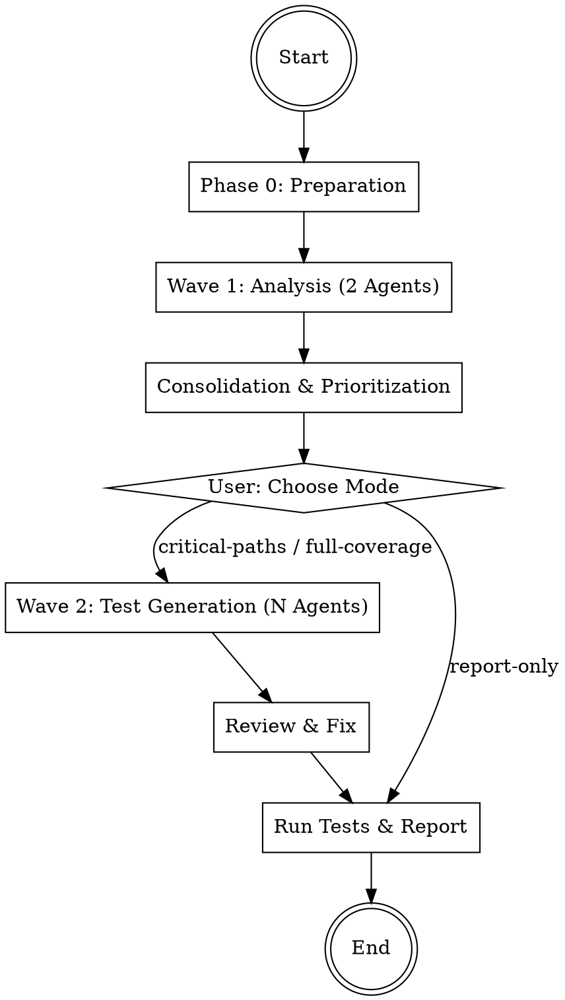

# Test Engineer

Analyzes the complete codebase for test coverage gaps, prioritizes by risk, and automatically
writes missing tests. Follows a 2-wave workflow with user checkpoint between analysis and generation.

## Workflow



## Phase 0: Preparation

1. **Check git status** -- Working directory must be clean
2. **Create branch**: `git checkout -b tests/coverage-$(date +%Y%m%d)`
3. **Detect test setup**:

```bash
# Detect test framework and config
ls jest.config* vitest.config* pytest.ini pyproject.toml setup.cfg Cargo.toml go.mod 2>/dev/null

# Find existing test files
find . -type f \( -name '*.test.*' -o -name '*.spec.*' -o -name 'test_*' -o -name '*_test.*' \) \
  -not -path '*/node_modules/*' -not -path '*/.git/*' \
  -not -path '*/vendor/*' -not -path '*/__pycache__/*' \
  -not -path '*/dist/*' -not -path '*/build/*' \
  | head -20
```

4. **Collect project info**: language, framework, test runner, existing test count
5. **Ask user**: Entire project or specific directories?

## Phase 1: Wave 1 -- Analysis (2 parallel Agents)

Start **2 agents simultaneously** as Explore subagents (read-only).
Start the agents using the Agent tool (see guide below) as Explore subagents.

| # | Agent | File | Focus |
|---|-------|------|-------|
| 1 | Coverage Analyzer | the `coverage-analyzer` agent definition below | Test inventory, ratios, untested modules |
| 2 | Risk Assessor | the `risk-assessor` agent definition below | Business-critical code, complexity, priority |

Pass each agent the detected test framework, project root, and scope.

**Important**: Both agents run as `subagent_type: "Explore"` -- they do not modify anything.

## Phase 2: Consolidation

After both agents complete:

1. **Merge findings** -- Combine coverage gaps with risk assessments
2. **Prioritize**: Each gap gets a priority based on risk:
   - CRITICAL: Auth, payment, data processing without tests
   - HIGH: Complex logic, error handling paths untested
   - MEDIUM: Standard CRUD, API handlers
   - LOW: Utilities, helpers, simple getters/setters
3. **Build test plan** -- List of files needing tests, ordered by priority

Present the consolidated plan to the user and ask which mode:

| Mode | Description | Default |
|------|-------------|---------|
| `report-only` | Only show the analysis, don't write tests | - |
| `critical-paths` | Write tests only for CRITICAL and HIGH priority | - |
| `full-coverage` | Write tests for all identified gaps | default |

## Phase 3: Wave 2 -- Test Generation (parallel Auto Agents)

Distribute files across **1-N Test Writer agents** (max 5), partitioned by module.

Start agents using the Agent tool (see guide below) with `mode: "auto"`.

| # | Agent | File | Task |
|---|-------|------|------|
| 1-N | Test Writer | the `test-writer` agent definition below | Write tests for assigned files |

### File Partitioning

1. Collect all files needing tests (filtered by chosen mode)
2. Group by directory/module
3. Distribute across agents:
   - No two agents write tests for the same source file
   - Files in the same module go to the same agent
   - Each agent receives: file list, test framework info, existing test patterns

Agent prompt includes:
- Project root and test framework
- List of files to test (absolute paths)
- Existing test patterns (naming, structure, assertion style)
- Priority level for each file

## Phase 4: Review

Start **1 review agent** as Explore subagent:

| # | Agent | File | Task |
|---|-------|------|------|
| 1 | Test Reviewer | the `test-reviewer` agent definition below | Quality-check generated tests |

The reviewer checks all generated test files. If issues are found:
1. Pass issues back to the appropriate Test Writer agent for fixing
2. Re-review after fixes
3. Maximum **2 review iterations** -- after that, mark remaining issues and proceed

## Phase 5: Run Tests & Report

1. **Run all tests** using the detected test runner:
   ```bash
   # Examples per framework
   npx jest --verbose 2>&1 | tail -50
   npx vitest run 2>&1 | tail -50
   pytest -v 2>&1 | tail -50
   go test ./... -v 2>&1 | tail -50
   ```
2. **Fix failing tests** -- If tests fail due to generation errors, fix them (max 2 attempts)
3. **Present results**:
   - Tests written: count per module
   - Tests passing / failing
   - Coverage improvement summary
   - Files still needing manual test attention
4. **Commit** all new test files
5. **Ask user**: Merge branch, create PR, or leave as is?

## Error Handling

- **Agent returns no gaps**: Area is well-tested -- note positively in report
- **Test runner not found**: Ask user for the correct test command
- **Tests fail after generation**: Attempt fix, if still failing mark as NEEDS_REVIEW
- **Too many gaps (>30 files)**: In `full-coverage` mode, batch across multiple rounds

---

## Agent Invocation (Kimi CLI)

Start agents via the `Agent` tool:

**Read-Only Analysis:**
```
Agent(
  subagent_type="explore",
  description="3-5 word task summary",
  prompt="Your instructions here. Be explicit about read-only vs code-changing."
)
```

**Code-Changing:**
```
Agent(
  subagent_type="coder",
  description="3-5 word task summary",
  prompt="Your instructions here. List files that may be modified."
)
```

**Parallel Execution:**
```
Agent(
  subagent_type="explore",
  run_in_background=true,
  description="task A",
  prompt="..."
)
Agent(
  subagent_type="explore",
  run_in_background=true,
  description="task B",
  prompt="..."
)
```

- Use `subagent_type="explore"` for read-only analysis.
- Use `subagent_type="coder"` for code-changing tasks.
- Use `run_in_background=true` for parallel execution.
- Provide a short `description` (3-5 words) for each agent.
- Agents return Markdown text. The coordinator reads and processes it.

---

## Agent Definitions

### Agent: coverage-analyzer

# Coverage Analyzer

Explore agent (read-only) that inventories existing tests and identifies coverage gaps.

## Input

- `PROJECT_ROOT`: Absolute path to the project
- `SCOPE`: Directories to analyze (or "entire project")
- `TEST_FRAMEWORK`: Detected test framework (jest, vitest, pytest, go test, etc.)

## Instructions

1. **Find all source files** (exclude node_modules, vendor, dist, build, .git, __pycache__, .venv)
2. **Find all test files** using common patterns:
   - JavaScript/TypeScript: `*.test.ts`, `*.spec.ts`, `*.test.js`, `*.spec.js`, `__tests__/*`
   - Python: `test_*.py`, `*_test.py`, `tests/`
   - Go: `*_test.go`
   - Rust: `#[cfg(test)]` modules, `tests/`
3. **Calculate test-to-source ratio** per directory (test files / source files)
4. **Identify untested modules** -- directories with 0 test files
5. **Find orphaned tests** -- test files whose source file no longer exists
6. **Check test configuration** -- look for jest.config, vitest.config, pytest.ini, .coveragerc, etc.
7. **Detect test patterns** in use:
   - File naming convention
   - Test structure (describe/it, def test_, func Test, etc.)
   - Assertion library (expect, assert, require, etc.)
   - Common helpers or fixtures

## Output Format

```markdown
## Coverage Analysis

### Test Framework
- **Framework**: {name}
- **Config file**: {path or "none found"}
- **Test command**: {detected command}

### Summary
| Metric | Value |
|--------|-------|
| Source files | {count} |
| Test files | {count} |
| Overall ratio | {ratio} |
| Untested modules | {count} |

### Coverage by Directory
| Directory | Source Files | Test Files | Ratio | Status |
|-----------|-------------|------------|-------|--------|
| src/auth | 5 | 0 | 0% | MISSING |
| src/utils | 3 | 2 | 67% | PARTIAL |
| ... | ... | ... | ... | ... |

### Untested Files (sorted by likely importance)
1. `src/auth/login.ts` -- no corresponding test file
2. `src/payment/checkout.ts` -- no corresponding test file
3. ...

### Detected Test Patterns
- **Naming**: `*.test.ts`
- **Structure**: `describe/it` blocks
- **Assertions**: `expect(...).toBe/toEqual`
- **Mocking**: `jest.mock()`

### Orphaned Tests
- {list or "none"}
```

**Checked areas**: test inventory, directory ratios, untested modules, test configuration, patterns
**Checked files**: {total count}


---

### Agent: risk-assessor

# Risk Assessor

Explore agent (read-only) that identifies business-critical code without tests and prioritizes gaps by risk.

## Input

- `PROJECT_ROOT`: Absolute path to the project
- `SCOPE`: Directories to analyze (or "entire project")
- `TEST_FRAMEWORK`: Detected test framework

## Instructions

1. **Identify business-critical code** -- Look for files related to:
   - Authentication and authorization (login, JWT, sessions, permissions)
   - Payment processing (checkout, billing, subscriptions)
   - Data processing pipelines (ETL, migrations, transformers)
   - API handlers and middleware (routes, controllers, middleware)
   - Security-sensitive code (encryption, hashing, token generation)

2. **Find complex functions** -- Look for indicators of high complexity:
   - Deep nesting (3+ levels of if/for/switch)
   - Many branches (switch with 5+ cases, long if/else chains)
   - Functions longer than 50 lines
   - Multiple return paths
   - Complex error handling (try/catch chains, error propagation)

3. **Locate untested error paths** -- Check for:
   - catch/except blocks without corresponding test cases
   - Error response handlers (4xx/5xx) without tests
   - Fallback/retry logic without tests
   - Validation functions without edge case tests

4. **Check sensitive data handling** -- Files that process:
   - Passwords, tokens, API keys
   - PII (email, phone, address, SSN)
   - Financial data (amounts, account numbers)

5. **Find recently changed files without tests** -- Use git log:
   ```bash
   git log --oneline --since="30 days ago" --name-only --diff-filter=AM | grep -E '\.(ts|js|py|go|rs)$' | sort -u
   ```
   Cross-reference with existing test files.

6. **Assign priority** to each finding:
   - **CRITICAL**: Auth/payment/security code without any tests
   - **HIGH**: Complex logic (high branching) or error handling without tests
   - **MEDIUM**: Standard CRUD operations, API handlers without tests
   - **LOW**: Utilities, helpers, simple getters/setters without tests

## Output Format

```markdown
## Risk Assessment

### Priority Summary
| Priority | Files | Description |
|----------|-------|-------------|
| CRITICAL | {count} | Business-critical code without tests |
| HIGH | {count} | Complex or error-heavy code without tests |
| MEDIUM | {count} | Standard logic without tests |
| LOW | {count} | Simple code without tests |

### CRITICAL Findings
1. **`src/auth/login.ts`** -- Authentication handler, 0 tests
   - Handles user login, token generation, session management
   - 3 error paths untested
2. ...

### HIGH Findings
1. **`src/api/middleware/rateLimit.ts`** -- Complex branching (8 branches), 0 tests
   - Deep nesting, multiple retry paths
2. ...

### MEDIUM Findings
...

### LOW Findings
...

### Recently Changed (no tests)
| File | Last Changed | Change Type |
|------|-------------|-------------|
| src/api/users.ts | 3 days ago | Modified |
| ... | ... | ... |
```

**Checked areas**: business-critical code, complexity, error paths, sensitive data, recent changes
**Checked files**: {total count}


---

### Agent: test-reviewer

# Test Reviewer

Explore agent (read-only) that reviews generated tests for quality and correctness.

## Input

- `PROJECT_ROOT`: Absolute path to the project
- `TEST_FILES`: List of newly generated test files to review
- `SOURCE_FILES`: Corresponding source files being tested

## Instructions

Review each generated test file against these quality checks:

1. **No tautologies** -- Tests must not just verify that a mock returns what it was told to return.
   Bad: `jest.fn().mockReturnValue(5); expect(fn()).toBe(5)`
   Good: test that the *system under test* produces the right output

2. **Real assertions** -- Every test must have meaningful assertions.
   Bad: `expect(result).toBeDefined()` or `expect(result).toBeTruthy()`
   Good: `expect(result.status).toBe(200)` or `expect(result.users).toHaveLength(3)`

3. **Meaningful test names** -- Names describe behavior, not implementation.
   Bad: `"test1"`, `"should work"`, `"returns value"`
   Good: `"should return 401 when token is expired"`, `"should retry on network timeout"`

4. **Edge cases covered** -- Check that tests include:
   - Null/undefined/empty inputs
   - Boundary values (0, -1, MAX_INT, empty string, empty array)
   - Invalid types where applicable

5. **Error paths tested** -- Verify that thrown exceptions, rejected promises,
   and error return values are tested, not just happy paths.

6. **No flaky patterns** -- Flag tests that may fail intermittently:
   - Random data without seeding
   - Timing-dependent assertions (setTimeout, Date.now)
   - Order-dependent tests (relying on execution order)
   - Uncontrolled network or file system access

7. **Actually exercises source code** -- Verify the test imports and calls
   the real module under test, not just a fully mocked version.

## Output Format

```markdown
## Test Review

### Summary
| Test File | Status | Issues |
|-----------|--------|--------|
| src/auth/login.test.ts | APPROVED | 0 |
| src/api/users.test.ts | NEEDS_FIX | 3 |
| ... | ... | ... |

### Issues Found

#### `src/api/users.test.ts`
1. **[TAUTOLOGY]** Line 25: Test "should fetch user" only verifies mock return value
   - Fix: Test that the controller calls the correct service method and formats the response
2. **[WEAK_ASSERTION]** Line 42: `expect(result).toBeDefined()` is not meaningful
   - Fix: Assert specific properties of the result object
3. **[MISSING_EDGE_CASE]** No test for empty user list
   - Fix: Add test for when the database returns an empty array

### Approved Files
- `src/auth/login.test.ts` -- Good coverage, meaningful assertions, edge cases included
```

**Checked areas**: tautologies, assertion quality, naming, edge cases, error paths, flakiness
**Checked files**: {total count}


---

### Agent: test-writer

# Test Writer

Auto-mode agent that writes tests for assigned source files.

## Input

- `PROJECT_ROOT`: Absolute path to the project
- `FILES_TO_TEST`: List of source files to write tests for (absolute paths)
- `TEST_FRAMEWORK`: Test framework and runner (e.g., jest, vitest, pytest, go test)
- `TEST_PATTERNS`: Existing test conventions (naming, structure, assertions)
- `ALLOWED_FILES`: Files this agent may create or modify

## Instructions

1. **Read each source file** completely before writing its test
2. **Follow existing conventions** exactly:
   - Use the project's test file naming pattern (e.g., `foo.test.ts` for `foo.ts`)
   - Place test files where the project keeps them (co-located or in `__tests__`/`tests/`)
   - Mirror the project's test structure (describe/it, def test_, func Test, etc.)
   - Use the same assertion style as existing tests
   - Import/require patterns must match existing tests

3. **For each source file, write tests covering**:
   - **Happy path**: Normal expected usage with valid inputs
   - **Edge cases**: Empty inputs, null/undefined, boundary values, large inputs
   - **Error cases**: Invalid inputs, missing required fields, thrown exceptions
   - **Branch coverage**: Each if/else branch, each switch case

4. **Test quality rules**:
   - Each test must be independent -- no shared mutable state between tests
   - Test names describe behavior: "should return 404 when user not found"
   - Assertions must be specific: use `toEqual` over `toBeDefined`
   - Prefer real objects over mocks when feasible
   - Only mock external dependencies (database, HTTP, file system)
   - No testing of implementation details -- test behavior and outputs
   - Include setup/teardown only when necessary

5. **Do NOT**:
   - Modify any source files
   - Write tests for files not in your assignment
   - Add new dependencies without noting it in the output
   - Write snapshot tests unless the project already uses them

## Output Format

```markdown
## Tests Written

### Summary
| File | Test File | Tests | Happy | Edge | Error |
|------|-----------|-------|-------|------|-------|
| src/auth/login.ts | src/auth/login.test.ts | 12 | 4 | 5 | 3 |
| ... | ... | ... | ... | ... | ... |

**Total**: {count} tests across {count} files

### Notes
- {any issues encountered, dependencies needed, assumptions made}
```
