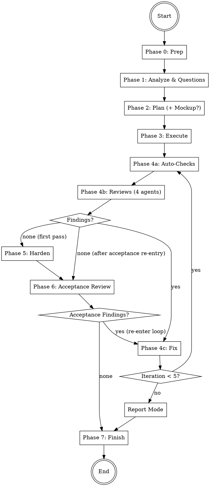

# Auto-Dev

Autonomous development agent that accepts any task, asks clarifying questions,
plans the implementation (with optional UI mockups), executes with parallel agents,
and verifies through a multi-stage review pipeline: 4-reviewer review-fix loop,
test hardening, and acceptance review. Fully autonomous after the initial question phase.

## Architecture

```
┌───────────────────────────────────────────────┐
│              COORDINATOR (you)                │
│  - Manage phases 0-7                          │
│  - Orchestrate agents                         │
│  - Handle review-fix + acceptance loop        │
│  - Track shared iteration budget              │
│  - Generate report                            │
└──────┬────────────────────────────────────────┘
       │ spawns
  ┌────┼────┬────────┬──────────┬──────────┬──────────┬──────────┐
  ▼    ▼    ▼        ▼          ▼          ▼          ▼          ▼
┌────┐┌────┐┌──────┐┌──────┐┌────────┐┌─────┐┌──────┐┌────────┐
│REQ ││PLAN││CODE  ││TEST  ││REVIEW  ││FIXER││TEST  ││MOCKUP  │
│ANLY││NER ││WORKER││RUNNER││AGENTS  ││(1-N)││WRITER││DESIGN. │
│    ││    ││(1-N) ││      ││(4)     ││     ││      ││(opt.)  │
│Ph.1││Ph.2││Ph. 3 ││Ph.4a ││Ph.4b/6 ││Ph.4c││Ph. 5 ││Ph. 2  │
└────┘└────┘└──────┘└──────┘└────────┘└─────┘└──────┘└────────┘
```

## Workflow



**Iteration budget:** Phases 4 and 6 share a maximum of **5 iterations** total.
If exhausted with open findings → enter **report mode** (no final commit, findings documented).

---

## Phase 0: Preparation

1. **Check git status** — Working directory must be clean (no uncommitted changes). If dirty, inform the user and stop.
2. **Create branch**: `git checkout -b auto-dev/<short-task-description>-$(date +%Y%m%d-%H%M%S)`
   - Derive `<short-task-description>` from the user's task (max 3 words, kebab-case)
3. **Store start commit**: `START_COMMIT=$(git rev-parse HEAD)` — needed for potential rollback
4. **Detect base branch**:
   ```bash
   BASE_BRANCH=$(gh repo view --json defaultBranchRef -q '.defaultBranchRef.name' 2>/dev/null \
     || git symbolic-ref --short refs/remotes/origin/HEAD 2>/dev/null | sed 's|origin/||' \
     || echo "main")
   ```
5. **Create working directory**: `mkdir -p .codewright/auto-dev/$(date +%Y%m%d-%H%M%S)`
   - This is the `RUN_DIR` for all artifacts of this run

---

## Phase 1: Analyze & Questions

Start the Requirement Analyst as a **Read-Only (Explore)** agent.
Read `agents/requirement-analyst.md` and start the agent according to `../../references/agent-invocation.md`.

Pass:
- **PROJECT_ROOT**: The project root path
- **TASK_DESCRIPTION**: The user's original task description

### After the agent returns:

1. Save the analysis to `{RUN_DIR}/task.md`
2. If the agent generated questions:
   - Present questions **one at a time** to the user
   - Each question includes a recommendation with reasoning — present it to the user
   - **Wait for the user's answer or follow-up questions before presenting the next question**
   - If the user has follow-up questions or wants clarification, answer them before moving on
   - Append each answer to `{RUN_DIR}/task.md`
   - Do NOT batch or skip questions — the user controls the pace
3. If 0 questions: proceed directly to Phase 2

**After all questions are answered, inform the user:**
> "All questions answered. I'll now plan and implement this autonomously. You'll see the result when everything is done."

From this point on, everything runs without user interaction (except mockup feedback in Phase 2 and report mode after exhausting iterations).

---

## Phase 2: Plan

Start the Planner as a **Read-Only (Explore)** agent.
Read `agents/planner.md` and start the agent according to `../../references/agent-invocation.md`.

Pass:
- **PROJECT_ROOT**: The project root path
- **TASK_DESCRIPTION**: The user's original task
- **ANALYSIS**: The Requirement Analyst's full analysis from `{RUN_DIR}/task.md`
- **USER_ANSWERS**: The user's answers (from `{RUN_DIR}/task.md`)

### After the agent returns:

1. Save the plan to `{RUN_DIR}/plan.md`
2. Create the initial todo list in `{RUN_DIR}/todos.md`:
   ```
   # Work Package Progress
   | WP | Title | Status |
   |----|-------|--------|
   | WP-1 | [Title] | pending |
   | WP-2 | [Title] | pending |
   ```
3. Parse the Execution Order for Phase 3

### Optional: UI Mockup

If the Planner flagged `ui_mockup: recommended` in its output (because the task involves UI/frontend changes):

1. Ask the user: **"The plan involves UI changes. Would you like me to create a visual mockup first?"**
2. If the user agrees:
   a. Start the Mockup Designer as a **Code-Changing (Auto Mode)** agent
      - Read `agents/mockup-designer.md` and start the agent
      - Pass: PROJECT_ROOT, PLAN, TASK_DESCRIPTION, UI_COMPONENTS (from plan)
   b. The agent creates an HTML mockup and starts a temporary server
   c. Present the URL to the user: **"Mockup available at http://localhost:{PORT}/mockup.html — take a look and let me know your feedback."**
   d. Wait for user feedback
   e. Append feedback to `{RUN_DIR}/plan.md`
   f. Stop the server process: `kill {PID}`
   g. Clean up: `rm .codewright/mockup.html`
   h. If significant changes requested: re-run Planner with feedback as additional context
3. If the user declines or the planner did not flag UI work: proceed to Phase 3

---

## Phase 3: Execute

Execute work packages according to the Execution Order from the plan.

For each parallel group:

1. Start all independent work packages simultaneously as **Code-Changing (Auto Mode)** agents
   - Read `agents/code-worker.md` and start agents according to `../../references/agent-invocation.md`
   - Use `run_in_background=true` with a unique `name` per agent (e.g., `worker-wp1`)
   - Pass each worker: PROJECT_ROOT, WORK_PACKAGE, FILE_LIST, TASK_CONTEXT
   - **For sequential work packages**: Also pass PREVIOUS_RESULTS from completed dependency WPs

2. Wait for all agents in the group to complete

3. Update `{RUN_DIR}/todos.md` — mark completed WPs

4. Commit after each parallel group:
   ```bash
   git add -A && git commit -m "feat(<scope>): implement <group summary>"
   ```

5. Proceed to next parallel group (if any)

After all work packages are complete, proceed to Phase 4.

---

## Phase 4: Review-Fix Loop

Maximum **5 iterations** (shared budget with Phase 6). Track iteration count starting at 1.
Track **active reviewers** — initially all 4, then only those with findings in the current round.

### Phase 4a: Auto-Checks

Start the Test Runner as a **Code-Changing (Auto Mode)** agent.
Read `agents/test-runner.md` and start the agent according to `../../references/agent-invocation.md`.

Pass: PROJECT_ROOT, and any known test/lint/typecheck commands from Phase 1 analysis.

**After the agent returns:**
- Save results to `{RUN_DIR}/iterations/iteration-{N}/auto-checks.md`
- If **all pass**: proceed to Phase 4b
- If **failures**: include failures as additional findings, proceed to Phase 4b

### Phase 4b: Code Reviews

Start all **active reviewers** in parallel as **Read-Only (Explore)** agents.

Read the respective agent files and start according to `../../references/agent-invocation.md`:
- `agents/logic-reviewer.md` — `[LOGIC]`
- `agents/security-reviewer.md` — `[SECURITY]`
- `agents/quality-reviewer.md` — `[QUALITY]`
- `agents/architecture-reviewer.md` — `[ARCH]`

Start all with `run_in_background=true`.

Pass each reviewer: PROJECT_ROOT, CHANGED_FILES, TASK_DESCRIPTION, PLAN_OVERVIEW.

**First iteration:** All 4 reviewers run.
**Subsequent iterations:** Only reviewers that reported findings in the previous round
re-enter. Reviewers with no findings are removed from the active set.

**After all reviewers return:**

1. Consolidate findings:
   - Deduplicate: findings targeting the same file + line range + problem are merged (highest severity wins, both recommendations preserved)
   - Group by file for Fixer agents
   - Order within each group by line number (top to bottom)
   - Save to `{RUN_DIR}/iterations/iteration-{N}/review-findings.md`
2. Add any auto-check failures as additional findings
3. **Update active reviewer set**: Only reviewers with findings in this round stay active
4. If **0 total findings**:
   - **First pass** (hardening not yet done): proceed to Phase 5 (Harden)
   - **After acceptance re-entry** (hardening already done): proceed to Phase 6 (Acceptance Review)
5. If **findings exist**: proceed to Phase 4c

### Phase 4c: Fix

1. Collect all findings from 4a and 4b
2. Group findings by file
3. Distribute across Fix Agents (file-partitioned — no two agents modify the same file)
4. Start Fix Agents as **Code-Changing (Auto Mode)** agents
   - Read `agents/fixer.md` and start according to `../../references/agent-invocation.md`
   - Use `run_in_background=true` for parallel execution
   - Pass each: PROJECT_ROOT, FILE_LIST, FINDINGS

5. After all Fix Agents return:
   - Save to `{RUN_DIR}/iterations/iteration-{N}/fixes.md`
   - Commit: `git add -A && git commit -m "fix: address review findings (iteration {N})"`

6. **Loop decision:**
   - If `iteration < 5`: Increment iteration, go back to Phase 4a
   - If `iteration >= 5` and still findings: **enter report mode** (skip to Phase 7)

---

## Phase 5: Harden

After the review-fix loop completes with 0 findings, harden the implementation
with additional tests.

Start the Test Writer as a **Code-Changing (Auto Mode)** agent.
Read `agents/test-writer.md` and start the agent according to `../../references/agent-invocation.md`.

Pass:
- **PROJECT_ROOT**: Path to the project directory
- **CHANGED_FILES**: All files modified during Phases 3 and 4
- **TASK_DESCRIPTION**: The original task
- **REVIEW_CONTEXT**: Key findings and fixes from the review loop (summary)
- **PLAN_OVERVIEW**: The test-relevant parts of the plan

**After the agent returns:**
- Save results to `{RUN_DIR}/hardening.md`
- If all tests pass: commit and proceed to Phase 6
  ```bash
  git add -A && git commit -m "test: add hardening tests (regression + edge cases)"
  ```
- If tests fail: the agent retries (max 3 attempts). If still failing → stop, inform user

---

## Phase 6: Acceptance Review

Final review of **all code changes AND all test files** (implementation + hardening)
by all 4 reviewers.

Start all 4 reviewers in parallel as **Read-Only (Explore)** agents (same agents as Phase 4b):
- `agents/logic-reviewer.md`
- `agents/security-reviewer.md`
- `agents/quality-reviewer.md`
- `agents/architecture-reviewer.md`

Pass each reviewer: PROJECT_ROOT, CHANGED_FILES (includes implementation + hardening tests),
TASK_DESCRIPTION, PLAN_OVERVIEW.

**After all reviewers return:**
- Save to `{RUN_DIR}/acceptance-review.md`
- If **0 findings**: proceed to Phase 7
- If **findings exist**: re-enter Phase 4c (Fix) with the new findings
  - **Reset the active reviewer set to all 4 reviewers** for the first re-entry round
  - This uses the **shared iteration budget** — if already at iteration 5, enter report mode
  - After fixes, the review-fix loop continues from Phase 4a
  - When Phase 4b finds 0 findings after acceptance re-entry, flow goes directly to Phase 6 (skip Phase 5 — hardening was already done)

---

## Phase 7: Finish

### Normal Mode (all findings resolved)

1. **Final commit** (if there are uncommitted changes):
   ```
   git add -A && git commit -m "feat: <short task description>

   Verified: <N> review iterations, hardening tests, acceptance review passed"
   ```

2. **Generate report** according to `references/report-template.md`
   - Save to `{RUN_DIR}/report.md`
   - Also display the report to the user

3. **Commit the .codewright artifacts**:
   ```bash
   git add .codewright/ && git commit -m "chore: add auto-dev run artifacts"
   ```

4. **Offer next steps to the user:**
   > "Auto-dev complete. The changes are on branch `<branch-name>`.
   >
   > What would you like to do?
   > 1. Create a PR
   > 2. Merge into the main branch
   > 3. Keep the branch open for further work"

### Report Mode (iterations exhausted with open findings)

If the review-fix loop reached the maximum of 5 iterations with findings still open:

1. **Do NOT create a final commit** — the code has unresolved issues
2. **Generate report** with all open findings clearly listed
   - Save to `{RUN_DIR}/report.md`
3. **Present to the user:**
   > "After 5 review iterations, there are still [N] open findings:
   >
   > [list of open findings with severity]
   >
   > The changes are on branch `<branch-name>` but have NOT been finalized.
   >
   > Options:
   > 1. Keep the changes as-is (I'll commit with open findings documented)
   > 2. Revert all changes (reset to the state before auto-dev started)
   > 3. Continue manually from here"

4. If user chooses keep: commit with findings documented in commit message
5. If user chooses revert: `git checkout {BASE_BRANCH} && git branch -D <auto-dev-branch>`
6. If user chooses continue: leave branch as-is for manual work

---

## Error Handling

- **Git dirty at start**: Inform user, do not proceed
- **Agent does not respond**: Wait max 5 minutes, then inform user which agent/area is affected
- **Agent reports an error**: Log it, continue with remaining agents, document in report
- **All workers in a group fail**: Inform user, offer rollback
- **No test runner/linter found**: Skip those checks, note in report as SKIPPED
- **Mockup server port conflict**: Try ports 8080-8090 sequentially
