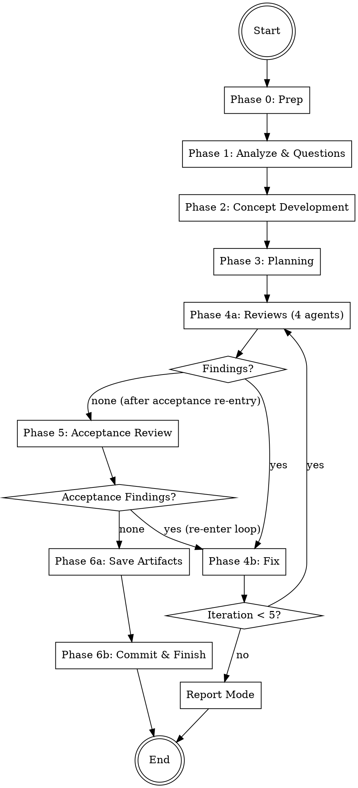

# Brainstormer

Autonomous brainstorming and concept-development agent that accepts any task,
analyzes requirements through adaptive questions, develops a comprehensive concept,
creates an implementation plan, and iterates with 4 reviewers until all are satisfied.
Saves final artifacts to `.codewright/plan` and `.codewright/imple`.
No code is written — this is pure planning and concept work.

## Architecture

```
┌───────────────────────────────────────────────┐
│              COORDINATOR (you)                │
│  - Manage phases 0-5                          │
│  - Orchestrate agents                         │
│  - Handle review-fix loop                     │
│  - Track shared iteration budget              │
│  - Generate report                            │
└──────┬────────────────────────────────────────┘
       │ spawns
  ┌────┼────┬────────┬────────┬────────┬────────┬────────┐
  ▼    ▼    ▼        ▼        ▼        ▼        ▼        ▼
┌────┐┌────┐┌──────┐┌──────┐┌────────┐┌─────┐┌────────┐
│REQ ││CONC││PLAN  ││REVIEW ││CONCEPT ││ACCEPT││CI/FINISH│
│ANLY││EPT ││NER   ││AGENTS ││FIXER   ││REVIEW││         │
│    ││DEV ││      ││(4)    ││        ││      ││         │
│Ph.1││Ph.2││Ph. 3 ││Ph.4b  ││Ph.4c   ││Ph. 5 ││Ph. 6    │
└────┘└────┘└──────┘└──────┘└────────┘└─────┘└────────┘
```

## Workflow



**Iteration budget:** Phases 4 and 5 share a maximum of **5 iterations** total.
If exhausted with open findings → enter **report mode** (artifacts saved with findings documented).

---

## Phase 0: Preparation

1. **Check git status** — Working directory should be clean. If dirty, warn user but proceed.
2. **Create branch**: `git checkout -b brainstorm/<short-task-description>-$(date +%Y%m%d-%H%M%S)`
   - Derive `<short-task-description>` from the user's task (max 3 words, kebab-case)
3. **Store start commit**: `START_COMMIT=$(git rev-parse HEAD)` — needed for potential rollback
4. **Detect base branch**:
   ```bash
   BASE_BRANCH=$(gh repo view --json defaultBranchRef -q '.defaultBranchRef.name' 2>/dev/null \
     || git symbolic-ref --short refs/remotes/origin/HEAD 2>/dev/null | sed 's|origin/||' \
     || echo "main")
   ```
5. **Create working directory**: `mkdir -p .codewright/brainstorm/$(date +%Y%m%d-%H%M%S)`
   - This is the `RUN_DIR` for all artifacts of this run
6. **Create artifact directories**:
   ```bash
   mkdir -p .codewright/plan
   mkdir -p .codewright/imple
   ```

---

## Phase 1: Analyze & Questions

Start the Requirement Analyst as a **Read-Only (Explore)** agent.
Read `agents/requirement-analyst.md` and start the agent according to `../../references/agent-invocation.md`.

Pass:
- **PROJECT_ROOT**: The project root path
- **TASK_DESCRIPTION**: The user's original task description

### After the agent returns:

1. Save the analysis to `{RUN_DIR}/task.md`
2. If the agent generated questions:
   - Present questions **one at a time** to the user
   - Each question includes a recommendation with reasoning — present it to the user
   - **Wait for the user's answer or follow-up questions before presenting the next question**
   - If the user has follow-up questions or wants clarification, answer them before moving on
   - Append each answer to `{RUN_DIR}/task.md`
   - Do NOT batch or skip questions — the user controls the pace
3. If 0 questions: proceed directly to Phase 2

**After all questions are answered, inform the user:**
> "All questions answered. I'll now develop a concept and implementation plan autonomously. You'll see the result when everything is done."

From this point on, everything runs without user interaction (except report mode after exhausting iterations).

---

## Phase 2: Concept Development

Start the Concept Developer as a **Read-Only (Explore)** agent.
Read `agents/concept-developer.md` and start the agent according to `../../references/agent-invocation.md`.

Pass:
- **PROJECT_ROOT**: The project root path
- **TASK_DESCRIPTION**: The user's original task description
- **ANALYSIS**: The Requirement Analyst's full analysis from `{RUN_DIR}/task.md`
- **USER_ANSWERS**: The user's answers (from `{RUN_DIR}/task.md`)

### After the agent returns:

1. Save the concept to `{RUN_DIR}/concept.md`
2. Validate that the concept follows `references/concept-format.md`
3. Proceed to Phase 3

---

## Phase 3: Planning

Start the Planner as a **Read-Only (Explore)** agent.
Read `agents/planner.md` and start the agent according to `../../references/agent-invocation.md`.

Pass:
- **PROJECT_ROOT**: The project root path
- **TASK_DESCRIPTION**: The user's original task description
- **CONCEPT**: The full concept document from `{RUN_DIR}/concept.md`
- **ANALYSIS**: The Requirement Analyst's analysis
- **USER_ANSWERS**: The user's answers (from `{RUN_DIR}/task.md`)

### After the agent returns:

1. Save the plan to `{RUN_DIR}/plan.md`
2. Validate that the plan follows `references/plan-format.md`
3. Create the initial todo list in `{RUN_DIR}/todos.md`:
   ```
   # Review Progress
   | Phase | Status |
   |-------|--------|
   | Concept & Plan Review | pending |
   | Acceptance Review | pending |
   ```
4. Proceed to Phase 4

---

## Phase 4: Review-Fix Loop

Maximum **5 iterations** (shared budget with Phase 5). Track iteration count starting at 1.
Track **active reviewers** — initially all 4, then only those with findings in the current round.

### Phase 4a: Reviews

Start all **active reviewers** in parallel as **Read-Only (Explore)** agents.

Read the respective agent files and start according to `../../references/agent-invocation.md`:
- `agents/logic-reviewer.md` — `[LOGIC]`
- `agents/quality-reviewer.md` — `[QUALITY]`
- `agents/architecture-reviewer.md` — `[ARCH]`
- `agents/security-reviewer.md` — `[SECURITY]`

Start all with `run_in_background=true`.

Pass each reviewer:
- **PROJECT_ROOT**: Path to the project directory
- **CHANGED_FILES**: `{RUN_DIR}/concept.md`, `{RUN_DIR}/plan.md`
- **TASK_DESCRIPTION**: The original task description
- **CONCEPT_OVERVIEW**: Summary of the concept
- **PLAN_OVERVIEW**: Summary of the implementation plan

**First iteration:** All 4 reviewers run.
**Subsequent iterations:** Only reviewers that reported findings in the previous round
re-enter. Reviewers with no findings are removed from the active set.

**After all reviewers return:**

1. Consolidate findings:
   - Deduplicate: findings targeting the same section + problem are merged (highest severity wins, both recommendations preserved)
   - Group by document (`concept.md` vs `plan.md`) for Fixer agents
   - Order within each group by section appearance (top to bottom)
   - Save to `{RUN_DIR}/iterations/iteration-{N}/review-findings.md`
2. **Update active reviewer set**: Only reviewers with findings in this round stay active
3. If **0 total findings**:
   - **First pass** (acceptance not yet done): proceed to Phase 5 (Acceptance Review)
   - **After acceptance re-entry**: proceed to Phase 6 (Save Artifacts)
4. If **findings exist**: proceed to Phase 4b

### Phase 4b: Fix

1. Collect all findings from 4a
2. Group findings by document
3. Start the Concept Fixer as a **Code-Changing (Auto Mode)** agent
   - Read `agents/concept-fixer.md` and start according to `../../references/agent-invocation.md`
   - Pass: PROJECT_ROOT, FILE_LIST (`{RUN_DIR}/concept.md`, `{RUN_DIR}/plan.md`), FINDINGS

4. After the Fixer returns:
   - Save results to `{RUN_DIR}/iterations/iteration-{N}/fixes.md`
   - Commit: `git add -A && git commit -m "docs: address review findings (iteration {N})"`

5. **Loop decision:**
   - If `iteration < 5`: Increment iteration, go back to Phase 4a
   - If `iteration >= 5` and still findings: **enter report mode** (skip to Phase 6)

---

## Phase 5: Acceptance Review

Final review of the concept and plan by all 4 reviewers.

Start all 4 reviewers in parallel as **Read-Only (Explore)** agents (same agents as Phase 4a):
- `agents/logic-reviewer.md`
- `agents/quality-reviewer.md`
- `agents/architecture-reviewer.md`
- `agents/security-reviewer.md`

Pass each reviewer: PROJECT_ROOT, CHANGED_FILES (`{RUN_DIR}/concept.md`, `{RUN_DIR}/plan.md`),
TASK_DESCRIPTION, CONCEPT_OVERVIEW, PLAN_OVERVIEW.

**After all reviewers return:**
- Save to `{RUN_DIR}/acceptance-review.md`
- If **0 findings**: proceed to Phase 6
- If **findings exist**: re-enter Phase 4b (Fix) with the new findings
  - **Reset the active reviewer set to all 4 reviewers** for the first re-entry round
  - This uses the **shared iteration budget** — if already at iteration 5, enter report mode
  - After fixes, the review-fix loop continues from Phase 4a
  - When Phase 4a finds 0 findings after acceptance re-entry, flow goes directly to Phase 6

---

## Phase 6: Save Artifacts & Finish

### Save Artifacts

1. Copy final concept to artifact location:
   ```bash
   cp {RUN_DIR}/concept.md .codewright/plan/concept.md
   ```

2. Copy final plan to artifact location:
   ```bash
   cp {RUN_DIR}/plan.md .codewright/imple/plan.md
   ```

3. Update `{RUN_DIR}/todos.md` — mark all phases complete

### Normal Mode (all findings resolved)

1. **Final commit** (if there are uncommitted changes):
   ```
   git add -A && git commit -m "docs: concept and implementation plan for <short task description>

   Verified: <N> review iterations, acceptance review passed"
   ```

2. **Generate report**:
   ```markdown
   # Brainstormer Report

   ## Task
   [Task description]

   ## Concept
   [Link to .codewright/plan/concept.md]

   ## Implementation Plan
   [Link to .codewright/imple/plan.md]

   ## Review Summary
   - **Iterations**: [N]
   - **Reviewers**: [List of reviewers that participated]
   - **Findings resolved**: [Count]

   ## Next Steps
   - Review the concept and plan
   - Proceed to implementation (e.g., using auto-dev)
   ```
   - Save to `{RUN_DIR}/report.md`
   - Also display the report to the user

3. **Commit the .codewright artifacts**:
   ```bash
   git add .codewright/ && git commit -m "chore: add brainstormer run artifacts"
   ```

4. **Present to the user:**
   > "Brainstormer complete. The concept and plan are ready.
   >
   > 📋 Concept: `.codewright/plan/concept.md`
   > 📋 Implementation Plan: `.codewright/imple/plan.md`
   >
   > What would you like to do?
   > 1. Proceed to implementation (auto-dev)
   > 2. Create a PR with just the plans
   > 3. Keep the branch open for further work"

### Report Mode (iterations exhausted with open findings)

If the review-fix loop reached maximum iterations with findings still open:

1. **Save artifacts anyway** — the documents have value even with open questions
2. **Generate report** with all open findings clearly listed:
   ```markdown
   # Brainstormer Report

   ## ⚠️ Open Findings
   After [N] review iterations, there are still [X] open issues:

   [list of open findings with severity and reviewer tag]

   ## Concept
   [Link to .codewright/plan/concept.md]

   ## Implementation Plan
   [Link to .codewright/imple/plan.md]
   ```
   - Save to `{RUN_DIR}/report.md`

3. **Present to the user:**
   > "After [N] review iterations, there are still [X] open issues in the concept/plan.
   >
   > The artifacts have been saved but contain unresolved findings:
   > [list of open findings]
   >
   > Options:
   > 1. Keep as-is and proceed to implementation
   > 2. Continue manually from here
   > 3. Discard and start over"

---

## Error Handling

- **Git dirty at start**: Warn user, but proceed (no code changes, only docs)
- **Agent does not respond**: Wait max 5 minutes, then inform user which agent/area is affected
- **Agent reports an error**: Log it, continue with remaining agents, document in report
- **No reviewers respond**: Inform user, offer to save current concept/plan as-is
- **Concept/Plan format violations**: Flag to coordinator, request re-run of the respective agent
