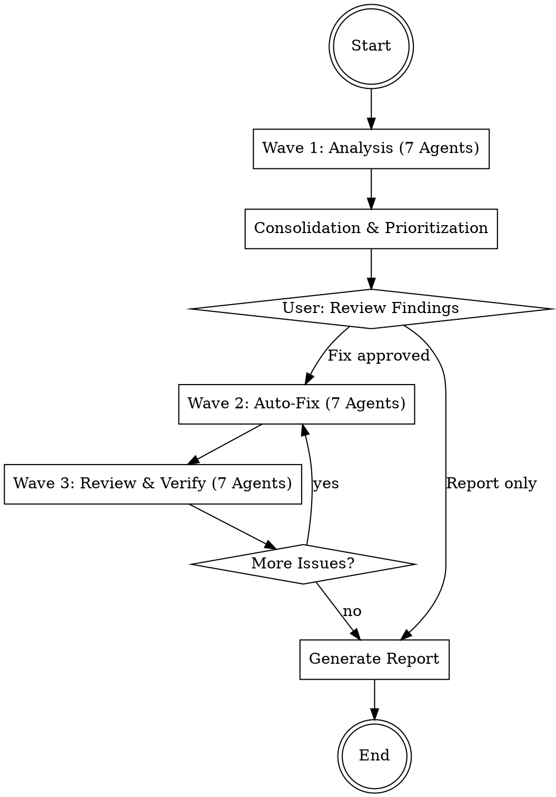

# Codebase Doctor

Analyzes the complete codebase with 7 parallel agents, automatically fixes discovered issues,
and generates a final report. Follows the wave-based workflow.

## Workflow



## Phase 0: Preparation

1. **Check git status** - Working directory must be clean
2. **Create new branch**: `git checkout -b doctor/$(date +%Y%m%d-%H%M%S)`
3. **Collect project info**:

```bash
# Detect language/framework
ls package.json pyproject.toml Cargo.toml go.mod Gemfile pom.xml 2>/dev/null

# Project size
find . -type f \
  -not -path '*/node_modules/*' -not -path '*/.git/*' \
  -not -path '*/vendor/*' -not -path '*/__pycache__/*' \
  -not -path '*/dist/*' -not -path '*/build/*' \
  -not -path '*/.venv/*' -not -path '*/venv/*' \
  | wc -l
```

4. **Ask user**: Entire project or specific directories?

## Phase 1: Wave 1 -- Analysis (7 parallel Agents)

Start **7 agents simultaneously** as Explore subagents (read-only).
Start the agents according to `../../references/agent-invocation.md` as Explore subagents.
Read the respective agent file and pass it as the prompt.

| # | Agent | File | Focus |
|---|-------|------|-------|
| 1 | Security Auditor | `agents/security.md` | Secrets, injection, insecure config |
| 2 | Bug Detector | `agents/bugs.md` | Logic errors, error handling, async |
| 3 | Code Quality | `agents/quality.md` | Dead code, duplicates, complexity |
| 4 | API Consistency | `agents/api-consistency.md` | Endpoint patterns, response formats |
| 5 | Dependency Analyzer | `agents/dependencies.md` | Outdated/insecure packages |
| 6 | Frontend Reviewer | `agents/frontend.md` | XSS, DOM safety, JS quality |
| 7 | Architecture Reviewer | `agents/architecture.md` | Structure, coupling, patterns |

Each agent delivers findings in the format from `references/finding-format.md`.

**Important**: Start all 7 agents as `subagent_type: "Explore"` -- they do not modify anything.

## Phase 2: Consolidation

After all 7 agents complete:

1. **Deduplicate** -- Merge identical findings from different agents
2. **Assign severity**:
   - 🔴 CRITICAL: Active security vulnerability, data loss, crashes
   - 🟠 HIGH: Security risk, severe bugs, CVEs
   - 🟡 MEDIUM: Potential bugs, outdated deps, maintainability issues
   - 🟢 LOW: Cleanup, style, nice-to-have
3. **Assess fixability**:
   - AUTO-FIX: Can be safely fixed automatically
   - MANUAL: Requires human decision
   - INFO: For awareness only, no fix needed
4. **Sort**: Critical -> High -> Medium -> Low

Show the user the consolidated list and ask:
- "Should I fix all auto-fixable issues?"
- "Only Critical/High?"
- "Report only without fixes?"

## Phase 3: Wave 2 -- Auto-Fix (7 parallel Agents)

Distribute the issues to fix across **7 agents**, where:

- **No two agents modify the same file** (avoid merge conflicts)
- Each agent receives a list of findings with concrete fix instructions
- Agents work with `mode: "auto"` for code changes

Agent prompt template:

```
You are a FIX AGENT. Fix the following issues:

Project: {PROJECT_ROOT}
Your files (you may ONLY modify these): {FILE_LIST}

Findings to fix:
{FINDINGS_LIST}

Rules:
1. Only modify the files assigned to you
2. Read each file completely before making changes
3. Follow existing code conventions
4. Run a syntax check after each change
5. Document each change

For each finding:
- Read the affected code section
- Implement the fix
- Verify the fix is correct
- If unsure: Skip and mark as "NEEDS_REVIEW"

At the end: List all fixes performed.
```

### File Partitioning

1. Collect all findings with `Fixable: auto`
2. Group by file
3. Distribute files across max. 7 agents:
   - No file may appear in two agents
   - Similar files (same module/directory) go to the same agent
   - Distribute load as evenly as possible
4. Findings with `Fixable: manual` or `info`: Skip, document in report

## Phase 4: Wave 3 -- Review & Verify (7 parallel Agents)

Start 7 review agents, where **each agent reviews the code of a different fix agent**:

| Review Agent | Reviews code from |
|---|---|
| 1 | Fix Agent 2 |
| 2 | Fix Agent 3 |
| ... | ... |
| 7 | Fix Agent 1 |

Each review agent:
1. Reads the modified files
2. Checks whether the fixes are correct
3. Checks whether new problems were introduced
4. Runs available linters/formatters (ruff, eslint, etc.)
5. Runs available tests
6. Reports: OK or issues

**If issues found**: Back to Wave 2 with the new issues.
**If 0 issues**: Proceed to report.

### Loop Limit

Wave 3 may jump back to Wave 2 at most **2 times**.
After the 2nd pass: Mark remaining issues as `NEEDS_REVIEW`
and document in report. Inform user.

## Phase 5: Report

Generate the report according to `references/report-template.md` and show it to the user.

Finally:
1. Commit all changes (if not already done)
2. Save report as `DOCTOR-REPORT.md`
3. Ask user: Merge branch, create PR, or leave as is?

## Mode Options

The user can choose before starting:

| Option | Description | Default |
|---|---|---|
| `scope` | Entire project or specific directories | Entire project |
| `mode` | `report-only`, `fix-critical`, `fix-all` | `fix-all` |
| `auto_commit` | Commit automatically | true |
| `create_branch` | Create separate branch | true |

## Error Handling

- **Agent returns no findings**: Area is clean -- note positively in report
- **Fix agent unsure**: Mark finding as NEEDS_REVIEW, do not force
- **Tests fail after fix**: Revert fix, document in report
- **Too many findings (>50)**: Only auto-fix Critical/High, rest in report
