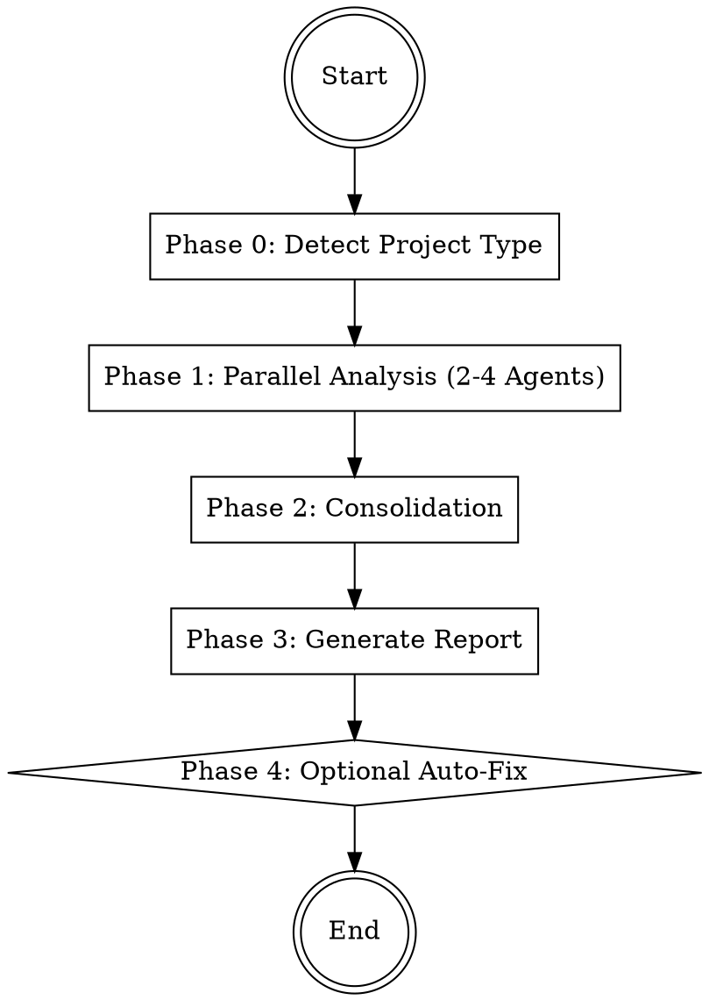

# Performance Analyzer

Analyzes the codebase for performance bottlenecks with up to 4 parallel agents, consolidates
findings by impact, and generates a structured performance report.

## Workflow



## Phase 0: Preparation

1. **Detect project type** by checking for key files:

```bash
# Frontend indicators
ls package.json next.config.* vite.config.* webpack.config.* angular.json 2>/dev/null

# Backend indicators
ls go.mod Cargo.toml pyproject.toml requirements.txt Gemfile pom.xml 2>/dev/null

# Database/ORM indicators
grep -rl "prisma\|sequelize\|typeorm\|sqlalchemy\|django.db\|ActiveRecord\|gorm\|diesel" --include="*.json" --include="*.toml" --include="*.txt" --include="*.rb" --include="*.go" . 2>/dev/null | head -5
```

2. **Classify** as `frontend`, `backend`, or `fullstack`
3. **Determine which agents to run**:
   - Bundle Analyzer: only if frontend or fullstack (package.json + frontend framework detected)
   - Query Analyzer: only if database/ORM detected
   - Runtime Analyzer: always
   - Infra Reviewer: always

## Phase 1: Parallel Analysis (2-4 Agents)

Start agents simultaneously as Explore subagents (read-only).
Follow `../../references/agent-invocation.md` for agent startup.

| # | Agent | File | Condition |
|---|-------|------|-----------|
| 1 | Bundle Analyzer | `agents/bundle-analyzer.md` | Frontend or fullstack only |
| 2 | Query Analyzer | `agents/query-analyzer.md` | Database/ORM detected only |
| 3 | Runtime Analyzer | `agents/runtime-analyzer.md` | Always |
| 4 | Infra Reviewer | `agents/infra-reviewer.md` | Always |

Pass each agent the detected project type and framework as context.

**Important**: All agents run as `subagent_type: "Explore"` -- they do not modify anything.

## Phase 2: Consolidation

After all agents complete:

1. **Deduplicate** -- Merge identical or overlapping findings from different agents
2. **Assign impact**:
   - **High**: User-visible latency, page load > 3s, query > 1s, bundle > 500KB unnecessary
   - **Medium**: Server-side inefficiency, suboptimal patterns, moderate waste
   - **Low**: Marginal improvement, cleanup, best-practice alignment
3. **Sort** by impact: High -> Medium -> Low
4. **Estimate savings** where possible (KB for bundle, ms for queries, complexity reduction)

## Phase 3: Generate Report

Generate `PERFORMANCE-REPORT.md` using the template from `references/report-template.md`.

Include:
- Executive summary with overall health assessment
- All findings grouped by impact level
- Quick wins section (easiest fixes with highest impact)
- Skipped analyses with reasons

Present the report to the user.

## Phase 4: Optional Auto-Fix

Ask the user:
- "Should I fix specific findings? Name the ones you want addressed."
- "Should I fix all quick wins?"
- "Report only, no changes?"

If fixes requested, create a new branch and apply changes using code-changing agents
with explicit file lists per `../../references/agent-invocation.md`.

## Error Handling

- **Agent returns no findings**: Note positively in report ("No issues found in this area")
- **Agent skipped**: Document in "Skipped Analyses" section with reason
- **Agent timeout**: Inform user which area was not analyzed, continue with remaining results
