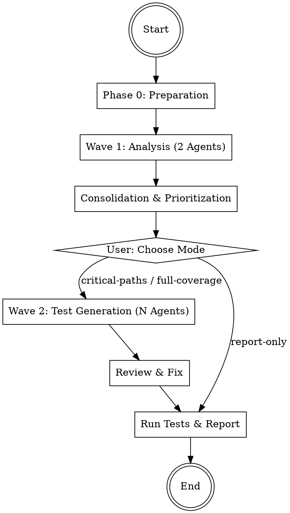

# Test Engineer

Analyzes the complete codebase for test coverage gaps, prioritizes by risk, and automatically
writes missing tests. Follows a 2-wave workflow with user checkpoint between analysis and generation.

## Workflow



## Phase 0: Preparation

1. **Check git status** -- Working directory must be clean
2. **Create branch**: `git checkout -b tests/coverage-$(date +%Y%m%d)`
3. **Detect test setup**:

```bash
# Detect test framework and config
ls jest.config* vitest.config* pytest.ini pyproject.toml setup.cfg Cargo.toml go.mod 2>/dev/null

# Find existing test files
find . -type f \( -name '*.test.*' -o -name '*.spec.*' -o -name 'test_*' -o -name '*_test.*' \) \
  -not -path '*/node_modules/*' -not -path '*/.git/*' \
  -not -path '*/vendor/*' -not -path '*/__pycache__/*' \
  -not -path '*/dist/*' -not -path '*/build/*' \
  | head -20
```

4. **Collect project info**: language, framework, test runner, existing test count
5. **Ask user**: Entire project or specific directories?

## Phase 1: Wave 1 -- Analysis (2 parallel Agents)

Start **2 agents simultaneously** as Explore subagents (read-only).
Start the agents according to `../../references/agent-invocation.md` as Explore subagents.

| # | Agent | File | Focus |
|---|-------|------|-------|
| 1 | Coverage Analyzer | `agents/coverage-analyzer.md` | Test inventory, ratios, untested modules |
| 2 | Risk Assessor | `agents/risk-assessor.md` | Business-critical code, complexity, priority |

Pass each agent the detected test framework, project root, and scope.

**Important**: Both agents run as `subagent_type: "Explore"` -- they do not modify anything.

## Phase 2: Consolidation

After both agents complete:

1. **Merge findings** -- Combine coverage gaps with risk assessments
2. **Prioritize**: Each gap gets a priority based on risk:
   - CRITICAL: Auth, payment, data processing without tests
   - HIGH: Complex logic, error handling paths untested
   - MEDIUM: Standard CRUD, API handlers
   - LOW: Utilities, helpers, simple getters/setters
3. **Build test plan** -- List of files needing tests, ordered by priority

Present the consolidated plan to the user and ask which mode:

| Mode | Description | Default |
|------|-------------|---------|
| `report-only` | Only show the analysis, don't write tests | - |
| `critical-paths` | Write tests only for CRITICAL and HIGH priority | - |
| `full-coverage` | Write tests for all identified gaps | default |

## Phase 3: Wave 2 -- Test Generation (parallel Auto Agents)

Distribute files across **1-N Test Writer agents** (max 5), partitioned by module.

Start agents according to `../../references/agent-invocation.md` with `mode: "auto"`.

| # | Agent | File | Task |
|---|-------|------|------|
| 1-N | Test Writer | `agents/test-writer.md` | Write tests for assigned files |

### File Partitioning

1. Collect all files needing tests (filtered by chosen mode)
2. Group by directory/module
3. Distribute across agents:
   - No two agents write tests for the same source file
   - Files in the same module go to the same agent
   - Each agent receives: file list, test framework info, existing test patterns

Agent prompt includes:
- Project root and test framework
- List of files to test (absolute paths)
- Existing test patterns (naming, structure, assertion style)
- Priority level for each file

## Phase 4: Review

Start **1 review agent** as Explore subagent:

| # | Agent | File | Task |
|---|-------|------|------|
| 1 | Test Reviewer | `agents/test-reviewer.md` | Quality-check generated tests |

The reviewer checks all generated test files. If issues are found:
1. Pass issues back to the appropriate Test Writer agent for fixing
2. Re-review after fixes
3. Maximum **2 review iterations** -- after that, mark remaining issues and proceed

## Phase 5: Run Tests & Report

1. **Run all tests** using the detected test runner:
   ```bash
   # Examples per framework
   npx jest --verbose 2>&1 | tail -50
   npx vitest run 2>&1 | tail -50
   pytest -v 2>&1 | tail -50
   go test ./... -v 2>&1 | tail -50
   ```
2. **Fix failing tests** -- If tests fail due to generation errors, fix them (max 2 attempts)
3. **Present results**:
   - Tests written: count per module
   - Tests passing / failing
   - Coverage improvement summary
   - Files still needing manual test attention
4. **Commit** all new test files
5. **Ask user**: Merge branch, create PR, or leave as is?

## Error Handling

- **Agent returns no gaps**: Area is well-tested -- note positively in report
- **Test runner not found**: Ask user for the correct test command
- **Tests fail after generation**: Attempt fix, if still failing mark as NEEDS_REVIEW
- **Too many gaps (>30 files)**: In `full-coverage` mode, batch across multiple rounds
