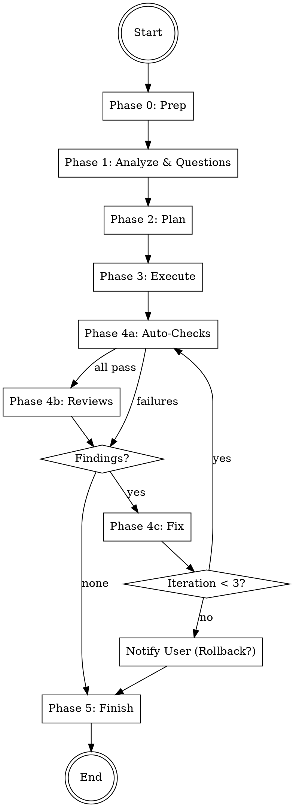

# Auto-Dev

Autonomous development agent that accepts any task, asks clarifying questions,
plans the implementation, executes with parallel agents, and verifies through
a review-fix loop. Fully autonomous after the initial question phase.

## Architecture

```
┌──────────────────────────────────────────┐
│            COORDINATOR (you)             │
│  - Manage phases 0-5                     │
│  - Orchestrate agents                    │
│  - Handle review-fix loop                │
│  - Generate report                       │
└──────┬───────────────────────────────────┘
       │ spawns
  ┌────┼────┬────────┬──────────┬──────────┐
  ▼    ▼    ▼        ▼          ▼          ▼
┌────┐┌────┐┌──────┐┌──────┐┌────────┐┌─────┐
│REQ ││PLAN││CODE  ││TEST  ││REVIEW  ││FIXER│
│ANLY││NER ││WORKER││RUNNER││AGENTS  ││(1-N)│
│    ││    ││(1-N) ││      ││(1-3)   ││     │
│Ph.1││Ph.2││Ph. 3 ││Ph.4a ││Ph. 4b  ││Ph.4c│
└────┘└────┘└──────┘└──────┘└────────┘└─────┘
```

## Workflow



---

## Phase 0: Preparation

1. **Check git status** — Working directory must be clean (no uncommitted changes). If dirty, inform the user and stop.
2. **Create branch**: `git checkout -b auto-dev/<short-task-description>-$(date +%Y%m%d-%H%M%S)`
   - Derive `<short-task-description>` from the user's task (max 3 words, kebab-case)
3. **Store start commit**: `START_COMMIT=$(git rev-parse HEAD)` — needed for potential rollback
4. **Create working directory**: `mkdir -p .codewright/auto-dev/$(date +%Y%m%d-%H%M%S)`
   - This is the `RUN_DIR` for all artifacts of this run

---

## Phase 1: Analyze & Questions

Start the Requirement Analyst as a **Read-Only (Explore)** agent.
Read `agents/requirement-analyst.md` and start the agent according to `../../references/agent-invocation.md`.

Pass:
- **PROJECT_ROOT**: The project root path
- **TASK_DESCRIPTION**: The user's original task description

### After the agent returns:

1. Save the analysis to `{RUN_DIR}/task.md`
2. If the agent generated questions:
   - Present questions **one at a time** to the user
   - Append each answer to `{RUN_DIR}/task.md`
3. If 0 questions: proceed directly to Phase 2

**After all questions are answered, inform the user:**
> "All questions answered. I'll now plan and implement this autonomously. You'll see the result when everything is done."

From this point on, everything runs without user interaction (except failure after 3 iterations).

---

## Phase 2: Plan

Start the Planner as a **Read-Only (Explore)** agent.
Read `agents/planner.md` and start the agent according to `../../references/agent-invocation.md`.

Pass:
- **PROJECT_ROOT**: The project root path
- **TASK_DESCRIPTION**: The user's original task
- **ANALYSIS**: The Requirement Analyst's full analysis from `{RUN_DIR}/task.md`
- **USER_ANSWERS**: The user's answers (from `{RUN_DIR}/task.md`)

### After the agent returns:

1. Save the plan to `{RUN_DIR}/plan.md`
2. Create the initial todo list in `{RUN_DIR}/todos.md`:
   ```
   # Work Package Progress
   | WP | Title | Status |
   |----|-------|--------|
   | WP-1 | [Title] | pending |
   | WP-2 | [Title] | pending |
   ```
3. Parse the Execution Order for Phase 3
4. Store the Review Strategy for Phase 4

---

## Phase 3: Execute

Execute work packages according to the Execution Order from the plan.

For each parallel group:

1. Start all independent work packages simultaneously as **Code-Changing (Auto Mode)** agents
   - Read `agents/code-worker.md` and start agents according to `../../references/agent-invocation.md`
   - Use `run_in_background=true` with a unique `name` per agent (e.g., `worker-wp1`)
   - Pass each worker: PROJECT_ROOT, WORK_PACKAGE, FILE_LIST, TASK_CONTEXT
   - **For sequential work packages**: Also pass PREVIOUS_RESULTS from completed dependency WPs

2. Wait for all agents in the group to complete

3. Update `{RUN_DIR}/todos.md` — mark completed WPs

4. Commit after each parallel group:
   ```bash
   git add -A && git commit -m "feat(<scope>): implement <group summary>"
   ```

5. Proceed to next parallel group (if any)

After all work packages are complete, proceed to Phase 4.

---

## Phase 4: Verify (Review-Fix Loop)

Maximum **3 iterations**. Track iteration count.

### Phase 4a: Auto-Checks

Start the Test Runner as a **Code-Changing (Auto Mode)** agent.
Read `agents/test-runner.md` and start the agent according to `../../references/agent-invocation.md`.

Pass: PROJECT_ROOT, and any known test/lint/typecheck commands from Phase 1 analysis.

**After the agent returns:**
- Save results to `{RUN_DIR}/iterations/iteration-{N}/auto-checks.md`
- If **all pass**: proceed to Phase 4b
- If **failures**: skip Phase 4b, go directly to Phase 4c

### Phase 4b: Code Reviews

Start only the reviewers selected by the Planner (from the Review Strategy).

Read the respective agent files and start as **Read-Only (Explore)** agents according to `../../references/agent-invocation.md`:
- `agents/logic-reviewer.md` — always included
- `agents/security-reviewer.md` — if selected
- `agents/quality-reviewer.md` — if selected

Start selected reviewers **in parallel** with `run_in_background=true`.

Pass each reviewer: PROJECT_ROOT, CHANGED_FILES, TASK_DESCRIPTION, PLAN_OVERVIEW.

**After all reviewers return:**
- Consolidate findings (deduplicate identical findings from different reviewers)
- Save to `{RUN_DIR}/iterations/iteration-{N}/review-findings.md`
- If **0 findings**: proceed to Phase 5
- If **findings exist**: proceed to Phase 4c

### Phase 4c: Fix

1. Collect all findings from 4a and 4b
2. Group findings by file
3. Distribute across Fix Agents (file-partitioned — no two agents modify the same file)
4. Start Fix Agents as **Code-Changing (Auto Mode)** agents
   - Read `agents/fixer.md` and start according to `../../references/agent-invocation.md`
   - Use `run_in_background=true` for parallel execution
   - Pass each: PROJECT_ROOT, FILE_LIST, FINDINGS

5. After all Fix Agents return:
   - Save to `{RUN_DIR}/iterations/iteration-{N}/fixes.md`
   - Commit: `git add -A && git commit -m "fix: address review findings (iteration {N})"`

6. **Loop decision:**
   - If `iteration < 3`: Go back to Phase 4a
   - If `iteration == 3` and still findings:
     - Notify the user:
       > "After 3 review iterations, there are still [N] open findings:
       > [list of open findings]
       >
       > Options:
       > 1. Keep the changes as-is (open findings will be documented in the report)
       > 2. Revert all changes (reset to the state before auto-dev started)"
     - If user chooses revert: `git checkout main && git branch -D <auto-dev-branch>`
     - If user chooses keep: proceed to Phase 5

---

## Phase 5: Finish

1. **Final commit** (if there are uncommitted changes):
   ```
   git add -A && git commit -m "feat: <short task description>

   Verified: <N> review iterations, all checks passing"
   ```

2. **Generate report** according to `references/report-template.md`
   - Save to `{RUN_DIR}/report.md`
   - Also display the report to the user

3. **Commit the .codewright artifacts**:
   ```bash
   git add .codewright/ && git commit -m "chore: add auto-dev run artifacts"
   ```

4. **Offer next steps to the user:**
   > "Auto-dev complete. The changes are on branch `<branch-name>`.
   >
   > What would you like to do?
   > 1. Create a PR
   > 2. Merge into the main branch
   > 3. Keep the branch open for further work"

---

## Error Handling

- **Git dirty at start**: Inform user, do not proceed
- **Agent does not respond**: Wait max 5 minutes, then inform user which agent/area is affected
- **Agent reports an error**: Log it, continue with remaining agents, document in report
- **All workers in a group fail**: Inform user, offer rollback
- **No test runner/linter found**: Skip those checks, note in report as SKIPPED
