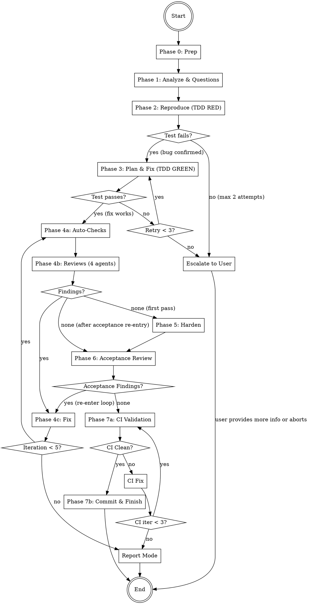

# Bug-Fixer

Specialized bug-fixing agent with TDD workflow. Takes a bug description,
analyzes root cause, writes a reproduction test (TDD RED), plans and implements
the minimal fix (TDD GREEN), then verifies through a multi-stage review
pipeline: 4-reviewer review-fix loop, test hardening, acceptance review,
and CI validation loop before commit.
Fully autonomous after the initial question phase.

## Architecture

```
┌─────────────────────────────────────────────────────┐
│                 COORDINATOR (you)                   │
│  - Manage phases 0-7                                │
│  - Orchestrate agents                               │
│  - Handle review-fix + acceptance + CI loops        │
│  - Track shared iteration budget + state variables  │
│  - Generate report                                  │
└──────┬──────────────────────────────────────────────┘
       │ spawns
  ┌────┼────┬────────┬──────────┬──────────┬──────────┬──────────┬──────────┐
  ▼    ▼    ▼        ▼          ▼          ▼          ▼          ▼          ▼
┌────┐┌────┐┌──────┐┌──────┐┌────────┐┌─────┐┌──────┐┌────────┐┌──────┐
│BUG ││FIX ││REPRO-││FIXER ││REVIEW  ││FIXER││TEST  ││TEST   ││CI    │
│ANLY││PLAN││DUCER ││      ││AGENTS  ││(fix)││RUNNER││WRITER ││VALID.│
│ST  ││NER ││      ││      ││(4)     ││     ││      ││       ││      │
│Ph.1││Ph.3││Ph. 2 ││Ph. 3 ││Ph.4b/6 ││Ph.4c││Ph.4a ││Ph. 5  ││Ph. 7 │
└────┘└────┘└──────┘└──────┘└────────┘└─────┘└──────┘└────────┘└──────┘
```

## Workflow



**Iteration budget:** Phases 4 and 6 share a maximum of **5 iterations** total.
If exhausted with open findings → enter **report mode** (no final commit, findings documented).

**State variables to track:**
- `ITERATION = 0` — current review-fix iteration count (max 5)
- `HARDENING_DONE = false` — set to `true` after Phase 5 completes
- `HAS_REPRO_TEST = false` — set to `true` after Phase 2 writes a passing reproduction test

---

## Phase 0: Preparation

1. **Check git status** — Working directory must be clean (no uncommitted changes). If dirty, inform the user and stop.
2. **Create branch**: `git checkout -b bug-fix/<short-bug-description>-$(date +%Y%m%d-%H%M%S)`
   - Derive `<short-bug-description>` from the user's bug description (max 3 words, kebab-case)
3. **Store start commit**: `START_COMMIT=$(git rev-parse HEAD)` — needed for potential rollback
4. **Detect base branch**:
   ```bash
   BASE_BRANCH=$(gh repo view --json defaultBranchRef -q '.defaultBranchRef.name' 2>/dev/null \
     || git symbolic-ref --short refs/remotes/origin/HEAD 2>/dev/null | sed 's|origin/||' \
     || echo "main")
   ```
5. **Create working directory**: `mkdir -p .codewright/bug-fixer/$(date +%Y%m%d-%H%M%S)`
   - This is the `RUN_DIR` for all artifacts of this run

---

## Phase 1: Analyze & Questions

Start the Bug Analyst as a **Read-Only (Explore)** agent.
Read `agents/bug-analyst.md` and start the agent according to `../../references/agent-invocation.md`.

Pass:
- **PROJECT_ROOT**: The project root path
- **BUG_DESCRIPTION**: The user's original bug description

### After the agent returns:

1. Save the analysis to `{RUN_DIR}/analysis.md`
2. If the agent generated questions:
   - Present questions **one at a time** to the user
   - Each question includes a recommendation with reasoning — present it to the user
   - **Wait for the user's answer or follow-up questions before presenting the next question**
   - If the user has follow-up questions or wants clarification, answer them before moving on
   - Append each answer to `{RUN_DIR}/analysis.md`
   - Do NOT batch or skip questions — the user controls the pace
3. If 0 questions: proceed directly to Phase 2

**After all questions are answered, inform the user:**
> "Analysis complete. I'll now reproduce, fix, and verify this bug autonomously. You'll see the result when everything is done."

From this point on, everything runs without user interaction (except report mode after exhausting iterations).

---

## Phase 2: Reproduce (TDD RED)

Start the Reproducer as a **Code-Changing (Auto Mode)** agent.
Read `agents/reproducer.md` and start the agent according to `../../references/agent-invocation.md`.

Pass:
- **PROJECT_ROOT**: The project root path
- **BUG_DESCRIPTION**: The user's original bug description
- **ANALYSIS**: The Bug Analyst's full analysis from `{RUN_DIR}/analysis.md`
- **USER_ANSWERS**: The user's answers (from `{RUN_DIR}/analysis.md`)

### After the agent returns:

1. Save the result to `{RUN_DIR}/reproduction.md`
2. Check the agent's output:
   - **Test written and FAILS** (expected): Bug confirmed. Set `HAS_REPRO_TEST = true`. Proceed to Phase 3.
     ```bash
     git add -A && git commit -m "test: add reproduction test for bug (<short description>)"
     ```
   - **Test written but PASSES** (unexpected): Bug not reproducible with this test.
     - If the agent provided alternative reproduction strategies: try them
     - If the analyst's root cause was uncertain: inform user that the bug could not be reproduced, ask for more details
     - Max 2 reproduction attempts before escalating to the user
   - **No test possible** (e.g., infrastructure bug, visual bug): Keep `HAS_REPRO_TEST = false`. Log as INFO, skip TDD enforcement, proceed to Phase 3 with a note that no reproduction test exists
   - **SETUP_FAILED** (test infrastructure could not be set up): Treat as "No test possible"

---

## Phase 3: Plan & Fix (TDD GREEN)

### Step 1: Plan the Fix

Start the Fix Planner as a **Read-Only (Explore)** agent.
Read `agents/fix-planner.md` and start the agent according to `../../references/agent-invocation.md`.

Pass:
- **PROJECT_ROOT**: The project root path
- **BUG_DESCRIPTION**: The user's original bug description
- **ANALYSIS**: Full analysis from `{RUN_DIR}/analysis.md`
- **REPRODUCTION**: Reproduction result from `{RUN_DIR}/reproduction.md`

After the agent returns:
- Save the plan to `{RUN_DIR}/fix-plan.md`

### Step 2: Apply the Fix

Start the Fixer as a **Code-Changing (Auto Mode)** agent.
Read `agents/fixer.md` and start the agent according to `../../references/agent-invocation.md`.

Pass:
- **PROJECT_ROOT**: The project root path
- **FIX_PLAN**: The fix plan from `{RUN_DIR}/fix-plan.md`
- **FILE_LIST**: Files the fixer is allowed to modify (from the plan)
- **BUG_DESCRIPTION**: The original bug description
- **REPRODUCTION_TEST**: Path to the reproduction test file (only if `HAS_REPRO_TEST == true`)

### After the Fixer returns:

1. Save the result to `{RUN_DIR}/fix-result.md`
2. **Verify the fix**:
   - If `HAS_REPRO_TEST == true`: Run the reproduction test
     - **PASSES**: Fix works. Commit and proceed to Phase 4.
       ```bash
       git add -A && git commit -m "fix(<scope>): <short bug description>"
       ```
     - **FAILS**: Fix did not resolve the bug.
       - Retry: Pass the failure output back to the Fixer with additional context
       - Max **3 attempts** total
       - If still failing after 3 attempts: inform user, offer to continue manually
   - If `HAS_REPRO_TEST == false`: Commit and proceed to Phase 4 (verification deferred to review loop)
     ```bash
     git add -A && git commit -m "fix(<scope>): <short bug description>"
     ```

---

## Phase 4: Review-Fix Loop

Maximum **5 iterations** (shared budget with Phase 6). Track iteration count starting at 1.
Track **active reviewers** — initially all 4, then only those with findings in the current round.

### Phase 4a: Auto-Checks

Start the Test Runner as a **Code-Changing (Auto Mode)** agent.
Read `agents/test-runner.md` and start the agent according to `../../references/agent-invocation.md`.

Pass: PROJECT_ROOT, and any known test/lint/typecheck commands from Phase 1 analysis.

**After the agent returns:**
- Save results to `{RUN_DIR}/iterations/iteration-{N}/auto-checks.md`
- If **all pass**: proceed to Phase 4b
- If **failures**: include failures as additional findings, proceed to Phase 4b

### Phase 4b: Code Reviews

Start all **active reviewers** in parallel as **Read-Only (Explore)** agents.

Read the respective agent files and start according to `../../references/agent-invocation.md`:
- `agents/logic-reviewer.md` — `[LOGIC]`
- `agents/security-reviewer.md` — `[SECURITY]`
- `agents/quality-reviewer.md` — `[QUALITY]`
- `agents/architecture-reviewer.md` — `[ARCH]`

Start all with `run_in_background=true`.

Pass each reviewer: PROJECT_ROOT, CHANGED_FILES, BUG_DESCRIPTION, FIX_PLAN_OVERVIEW.

**First iteration:** All 4 reviewers run.
**Subsequent iterations:** Only reviewers that reported findings in the previous round
re-enter. Reviewers with no findings are removed from the active set.

**After all reviewers return:**

1. Consolidate findings:
   - Deduplicate: findings targeting the same file + line range + problem are merged (highest severity wins, both recommendations preserved)
   - Group by file for Fixer agents
   - Order within each group by line number (top to bottom)
   - Save to `{RUN_DIR}/iterations/iteration-{N}/review-findings.md`
2. Add any auto-check failures as additional findings
3. **Update active reviewer set**: Only reviewers with findings in this round stay active
4. If **0 total findings**:
   - If `HARDENING_DONE == false`: proceed to Phase 5 (Harden)
   - If `HARDENING_DONE == true`: proceed to Phase 6 (Acceptance Review)
5. If **findings exist**: proceed to Phase 4c

### Phase 4c: Fix

1. Collect all findings from 4a and 4b
2. Group findings by file
3. Distribute across Fix Agents (file-partitioned — no two agents modify the same file)
4. Start Fix Agents as **Code-Changing (Auto Mode)** agents
   - Read `agents/fixer.md` and start according to `../../references/agent-invocation.md`
   - Use `run_in_background=true` for parallel execution
   - Pass each: PROJECT_ROOT, FILE_LIST, FINDINGS

5. After all Fix Agents return:
   - Save to `{RUN_DIR}/iterations/iteration-{N}/fixes.md`
   - Commit: `git add -A && git commit -m "fix: address review findings (iteration {N})"`

6. **Loop decision:**
   - If `iteration < 5`: Increment iteration, go back to Phase 4a
   - If `iteration >= 5` and still findings: **enter report mode** (skip to Phase 7)

---

## Phase 5: Harden

After the review-fix loop completes with 0 findings, harden the fix
with additional tests.

Start the Test Writer as a **Code-Changing (Auto Mode)** agent.
Read `agents/test-writer.md` and start the agent according to `../../references/agent-invocation.md`.

Pass:
- **PROJECT_ROOT**: Path to the project directory
- **CHANGED_FILES**: All files modified during Phases 3 and 4
- **BUG_DESCRIPTION**: The original bug description
- **REVIEW_CONTEXT**: Key findings and fixes from the review loop (summary)
- **FIX_PLAN_OVERVIEW**: The fix-relevant parts of the plan

**After the agent returns:**
- Save results to `{RUN_DIR}/hardening.md`
- If all tests pass: set `HARDENING_DONE = true`, commit, and proceed to Phase 6
  ```bash
  git add -A && git commit -m "test: add hardening tests (regression + edge cases)"
  ```
- If tests fail: the agent retries (max 3 attempts). If still failing → stop, inform user

---

## Phase 6: Acceptance Review

Final review of **all code changes AND all test files** (fix + hardening)
by all 4 reviewers.

Start all 4 reviewers in parallel as **Read-Only (Explore)** agents (same agents as Phase 4b):
- `agents/logic-reviewer.md`
- `agents/security-reviewer.md`
- `agents/quality-reviewer.md`
- `agents/architecture-reviewer.md`

Pass each reviewer: PROJECT_ROOT, CHANGED_FILES (includes fix + hardening tests),
BUG_DESCRIPTION, FIX_PLAN_OVERVIEW.

**After all reviewers return:**
- Save to `{RUN_DIR}/acceptance-review.md`
- If **0 findings**: proceed to Phase 7
- If **findings exist**: re-enter Phase 4c (Fix) with the new findings
  - **Reset the active reviewer set to all 4 reviewers** for the first re-entry round
  - This uses the **shared iteration budget** — if already at iteration 5, enter report mode
  - After fixes, the review-fix loop continues from Phase 4a
  - When Phase 4b finds 0 findings after acceptance re-entry, flow goes directly to Phase 6 (skip Phase 5 — hardening was already done)

---

## Phase 7: CI Validation & Finish

### CI Validation Loop

Before creating any final commit, run the full CI validation loop to ensure all
project checks pass. This loop has its own budget of **3 iterations** (separate
from the review-fix loop budget).

Initialize: `ci_iteration = 0`

#### Step 1: Run CI Validator

Start the CI Validator as a **Code-Changing (Auto Mode)** agent.
Read `agents/ci-validator.md` and start the agent according to `../../references/agent-invocation.md`.

Pass:
- **PROJECT_ROOT**: Path to the project directory
- **BUILD_COMMAND**, **TEST_COMMAND**, **LINT_COMMAND**, **TYPECHECK_COMMAND**: Any known commands from Phase 1 analysis
- **CI_COMMANDS**: Any additional CI commands detected during the run

Save results to `{RUN_DIR}/ci-validation/iteration-{ci_iteration}.md`

#### Step 2: Evaluate Results

- If **all checks pass** (Overall: PASS): proceed to **Commit** (Normal Mode below)
- If **failures exist** and `ci_iteration < 3`:
  1. Increment `ci_iteration`
  2. Group CI failures by file
  3. Start Fix Agents as **Code-Changing (Auto Mode)** agents
     - Read `agents/fixer.md` and start according to `../../references/agent-invocation.md`
     - Use `run_in_background=true` for parallel execution (file-partitioned)
     - Pass: PROJECT_ROOT, FILE_LIST, FINDINGS (CI failures formatted as findings)
  4. After all Fix Agents return:
     ```bash
     git add -A && git commit -m "fix: resolve CI failures (ci-validation iteration {ci_iteration})"
     ```
  5. Go back to **Step 1**
- If `ci_iteration >= 3` and **failures persist**: enter **Report Mode**

### Normal Mode (all findings resolved + CI passing)

1. **Final commit** (if there are uncommitted changes):
   ```
   git add -A && git commit -m "fix: <short bug description>

   Root cause: <one-line root cause from analysis>
   Verified: <N> review iterations, hardening tests, acceptance review passed, CI clean"
   ```

2. **Generate report** according to `references/report-template.md`
   - Save to `{RUN_DIR}/report.md`
   - Also display the report to the user

3. **Commit the .codewright artifacts**:
   ```bash
   git add .codewright/ && git commit -m "chore: add bug-fixer run artifacts"
   ```

4. **Offer next steps to the user:**
   > "Bug fix complete. The changes are on branch `<branch-name>`.
   >
   > What would you like to do?
   > 1. Create a PR
   > 2. Merge into the main branch
   > 3. Keep the branch open for further work"

### Report Mode (iterations exhausted with open findings)

If the review-fix loop OR CI validation loop reached their maximum iterations
with findings still open:

1. **Do NOT create a final commit** — the code has unresolved issues
2. **Generate report** with all open findings clearly listed
   - Include both review findings and CI failures (if any)
   - Save to `{RUN_DIR}/report.md`
3. **Present to the user:**
   > "After [N] review iterations and [M] CI validation iterations,
   > there are still [X] open issues:
   >
   > [list of open findings/CI failures with severity]
   >
   > The changes are on branch `<branch-name>` but have NOT been finalized.
   >
   > Options:
   > 1. Keep the changes as-is (I'll commit with open findings documented)
   > 2. Revert all changes (reset to the state before bug-fixer started)
   > 3. Continue manually from here"

4. If user chooses keep: commit with findings documented in commit message
5. If user chooses revert: `git checkout {BASE_BRANCH} && git branch -D <bug-fix-branch>`
6. If user chooses continue: leave branch as-is for manual work

---

## Error Handling

- **Git dirty at start**: Inform user, do not proceed
- **Bug not reproducible**: After 2 attempts, ask user for more details or offer to proceed without reproduction test
- **Fix does not pass reproduction test**: After 3 attempts, inform user and offer manual continuation
- **Agent does not respond**: Wait max 5 minutes, then inform user which agent/area is affected
- **Agent reports an error**: Log it, continue with remaining agents, document in report
- **No test runner/linter found**: Skip those checks, note in report as SKIPPED
