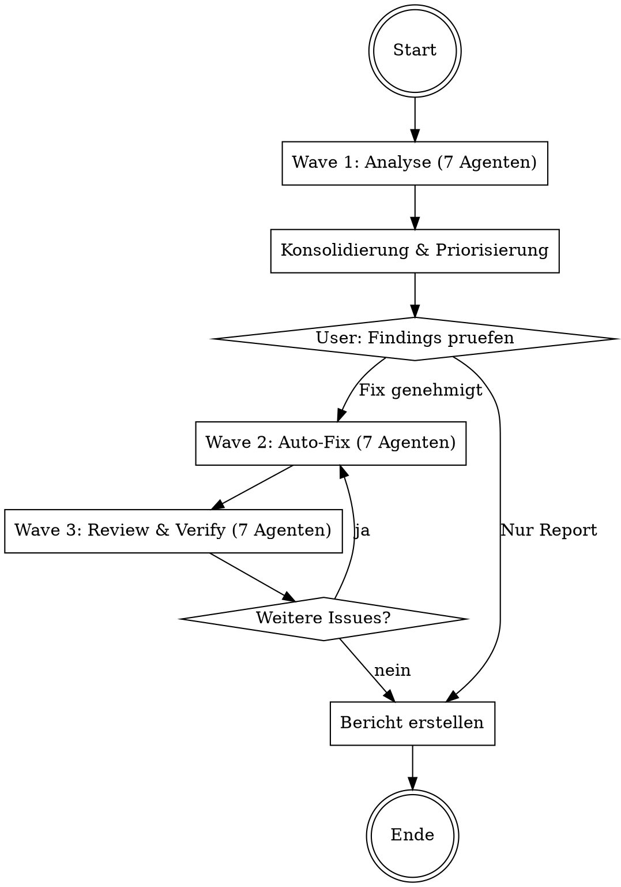

# Codebase Doctor

Analysiert die komplette Codebase mit 7 parallelen Agenten, behebt gefundene Issues
automatisch und erstellt einen Abschlussbericht. Folgt dem Wave-basierten Workflow.

## Ablauf



## Phase 0: Vorbereitung

1. **Git-Status pruefen** - Arbeitsverzeichnis muss sauber sein
2. **Neuen Branch erstellen**: `git checkout -b doctor/$(date +%Y%m%d-%H%M%S)`
3. **Projekt-Info sammeln**:

```bash
# Sprache/Framework erkennen
ls package.json pyproject.toml Cargo.toml go.mod Gemfile pom.xml 2>/dev/null

# Projektgroesse
find . -type f \
  -not -path '*/node_modules/*' -not -path '*/.git/*' \
  -not -path '*/vendor/*' -not -path '*/__pycache__/*' \
  -not -path '*/dist/*' -not -path '*/build/*' \
  -not -path '*/.venv/*' -not -path '*/venv/*' \
  | wc -l
```

4. **User fragen**: Gesamtes Projekt oder bestimmte Verzeichnisse?

## Phase 1: Wave 1 — Analyse (7 parallele Agenten)

Starte **7 Agenten gleichzeitig** als Explore-Subagenten (read-only).
Lies die jeweilige Agent-Datei und uebergib sie als Prompt.

| # | Agent | Datei | Fokus |
|---|-------|-------|-------|
| 1 | Security Auditor | `agents/security.md` | Secrets, Injection, unsichere Config |
| 2 | Bug Detector | `agents/bugs.md` | Logikfehler, Error Handling, Async |
| 3 | Code Quality | `agents/quality.md` | Dead Code, Duplikate, Komplexitaet |
| 4 | API Consistency | `agents/api-consistency.md` | Endpunkt-Muster, Response-Formate |
| 5 | Dependency Analyzer | `agents/dependencies.md` | Veraltete/unsichere Packages |
| 6 | Frontend Reviewer | `agents/frontend.md` | XSS, DOM-Sicherheit, JS-Qualitaet |
| 7 | Architecture Reviewer | `agents/architecture.md` | Struktur, Kopplung, Patterns |

Jeder Agent liefert Findings im Format aus `references/finding-format.md`.

**Wichtig**: Alle 7 Agenten als `subagent_type: "Explore"` starten — sie aendern nichts.

## Phase 2: Konsolidierung

Nach Abschluss aller 7 Agenten:

1. **Deduplizieren** — Gleiche Findings aus verschiedenen Agenten zusammenfuehren
2. **Severity zuweisen**:
   - CRITICAL: Aktive Sicherheitsluecke, Datenverlust, Crashes
   - HIGH: Sicherheitsrisiko, schwere Bugs, CVEs
   - MEDIUM: Potenzielle Bugs, veraltete Deps, Wartbarkeitsprobleme
   - LOW: Cleanup, Style, nice-to-have
3. **Fixbarkeit bewerten**:
   - AUTO-FIX: Kann sicher automatisch behoben werden
   - MANUAL: Braucht menschliche Entscheidung
   - INFO: Nur zur Kenntnis, kein Fix noetig
4. **Sortieren**: Critical -> High -> Medium -> Low

Zeige dem User die konsolidierte Liste und frage:
- "Soll ich alle auto-fixbaren Issues beheben?"
- "Nur Critical/High?"
- "Nur Report ohne Fixes?"

## Phase 3: Wave 2 — Auto-Fix (7 parallele Agenten)

Verteile die zu fixenden Issues auf **7 Agenten**, wobei:

- **Keine zwei Agenten die gleiche Datei aendern** (Merge-Konflikte vermeiden)
- Jeder Agent bekommt eine Liste von Findings mit konkreten Fix-Anweisungen
- Agenten arbeiten mit `mode: "auto"` fuer Code-Aenderungen

Agent-Prompt-Template:

```
Du bist ein FIX AGENT. Behebe die folgenden Issues:

Projekt: {PROJECT_ROOT}
Deine Dateien (NUR diese darfst du aendern): {FILE_LIST}

Findings zu beheben:
{FINDINGS_LIST}

Regeln:
1. Aendere NUR die dir zugewiesenen Dateien
2. Lies jede Datei vollstaendig bevor du aenderst
3. Halte dich an die bestehenden Code-Conventions
4. Fuehre nach jeder Aenderung eine Syntax-Pruefung durch
5. Dokumentiere jede Aenderung

Fuer jedes Finding:
- Lies den betroffenen Code-Bereich
- Implementiere den Fix
- Pruefe dass der Fix korrekt ist
- Wenn unsicher: Ueberspringe und markiere als "NEEDS_REVIEW"

Am Ende: Liste alle durchgefuehrten Fixes.
```

### Datei-Partitionierung

1. Sammle alle Findings mit `Fixbar: auto`
2. Gruppiere nach Datei
3. Verteile Dateien auf max. 7 Agenten:
   - Keine Datei darf in zwei Agenten vorkommen
   - Aehnliche Dateien (gleiches Modul/Verzeichnis) beim gleichen Agenten
   - Last moeglichst gleichmaessig verteilen
4. Findings mit `Fixbar: manual` oder `info`: Ueberspringen, im Bericht dokumentieren

## Phase 4: Wave 3 — Review & Verify (7 parallele Agenten)

Starte 7 Review-Agenten, wobei **jeder Agent den Code eines anderen Fix-Agenten reviewt**:

| Review Agent | Prueft Code von |
|---|---|
| 1 | Fix-Agent 2 |
| 2 | Fix-Agent 3 |
| ... | ... |
| 7 | Fix-Agent 1 |

Jeder Review-Agent:
1. Liest die geaenderten Dateien
2. Prueft ob die Fixes korrekt sind
3. Prueft ob neue Probleme eingefuehrt wurden
4. Fuehrt vorhandene Linter/Formatter aus (ruff, eslint, etc.)
5. Fuehrt vorhandene Tests aus
6. Meldet: OK oder Issues

**Wenn Issues gefunden**: Zurueck zu Wave 2 mit den neuen Issues.
**Wenn 0 Issues**: Weiter zum Bericht.

### Loop-Limit

Wave 3 darf maximal **2x** zurueck zu Wave 2 springen.
Nach dem 2. Durchlauf: Verbleibende Issues als `NEEDS_REVIEW` markieren
und im Bericht dokumentieren. User informieren.

## Phase 5: Bericht

Erstelle den Report nach `references/report-template.md` und zeige ihn dem User.

Abschliessend:
1. Alle Aenderungen committen (wenn nicht schon geschehen)
2. Report als `DOCTOR-REPORT.md` speichern
3. User fragen: Branch mergen, PR erstellen, oder so lassen?

## Modus-Optionen

Der User kann vor dem Start waehlen:

| Option | Beschreibung | Default |
|---|---|---|
| `scope` | Ganzes Projekt oder bestimmte Verzeichnisse | Ganzes Projekt |
| `mode` | `report-only`, `fix-critical`, `fix-all` | `fix-all` |
| `auto_commit` | Automatisch committen | true |
| `create_branch` | Separaten Branch erstellen | true |

## Fehlerbehandlung

- **Agent liefert keine Findings**: Bereich ist sauber — im Report positiv vermerken
- **Fix-Agent unsicher**: Finding als NEEDS_REVIEW markieren, nicht forcieren
- **Tests schlagen fehl nach Fix**: Fix revertieren, im Report dokumentieren
- **Zu viele Findings (>50)**: Nur Critical/High auto-fixen, Rest im Report
