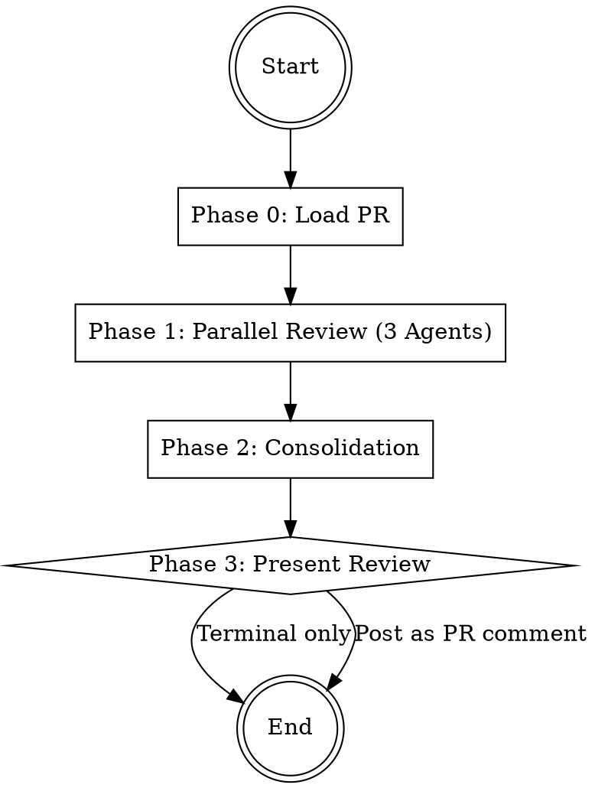

# PR Reviewer

Analyzes a Pull Request from 3 perspectives in parallel (logic, security, quality),
consolidates findings, and optionally posts the review as a GitHub comment.

## Workflow



## Phase 0: Load PR

1. **Determine PR number** from user input (number, URL, or current branch).
   If no PR is specified, detect via `gh pr view --json number`.
2. **Fetch PR data**:

```bash
# Get PR metadata and diff
gh pr view <NUMBER> --json title,body,files,additions,deletions,baseRefName,headRefName
gh pr diff <NUMBER>
```

3. **Validate**: If the diff is empty or the PR is already merged, inform the user and stop.
4. **Summarize** the PR for the agents: title, description, number of files changed, total lines changed.

## Phase 1: Parallel Review (3 Agents)

Start **3 agents simultaneously** as Explore subagents (read-only).
Start the agents according to `../../references/agent-invocation.md` as Explore subagents.

| # | Agent | File | Focus |
|---|-------|------|-------|
| 1 | Logic Reviewer | `agents/logic-reviewer.md` | Correctness, edge cases, error handling, regressions |
| 2 | Security Reviewer | `agents/security-reviewer.md` | Vulnerabilities, secrets, auth, input validation |
| 3 | Quality Reviewer | `agents/quality-reviewer.md` | Style, complexity, naming, tests, consistency |

Each agent receives:
- The full PR diff
- The PR title and description
- The list of changed files

**Important**: All 3 agents run as `subagent_type: "Explore"` -- they do not modify anything.
The PR diff is the primary input. Agents focus on CHANGED code, not the entire codebase.

## Phase 2: Consolidation

After all 3 agents complete:

1. **Deduplicate** -- Merge findings that describe the same issue from different perspectives
2. **Assign severity**:
   - `blocking`: Must be fixed before merging (bugs, security holes, broken logic)
   - `suggestion`: Should be fixed, improves quality significantly
   - `nitpick`: Optional improvement, stylistic preference
3. **Sort**: blocking -> suggestion -> nitpick
4. **Count**: Total findings per severity level

## Phase 3: Present Review

Show the consolidated review to the user in this format:

```markdown
# PR Review: <PR Title> (#<number>)

**Summary**: <1-2 sentence overview of the review>
**Verdict**: APPROVE / REQUEST_CHANGES / COMMENT

| Severity | Count |
|----------|-------|
| Blocking | X |
| Suggestion | Y |
| Nitpick | Z |

---

## Blocking Issues

### [TAG] <title>
- **Severity**: blocking
- **File**: `path/to/file.ext` (line X-Y)
- **Description**: What is the issue?
- **Suggestion**: How to fix it

## Suggestions

...

## Nitpicks

...
```

Then ask the user:
- **Option A**: "Keep this review in the terminal only" (default)
- **Option B**: "Post as a GitHub PR review comment"

If Option B:
```bash
gh pr review <NUMBER> --comment --body "<REVIEW_BODY>"
# Or if blocking issues exist:
gh pr review <NUMBER> --request-changes --body "<REVIEW_BODY>"
# Or if no blocking issues:
gh pr review <NUMBER> --approve --body "<REVIEW_BODY>"
```

## Verdict Logic

- **REQUEST_CHANGES**: 1 or more blocking findings
- **APPROVE**: 0 blocking findings and 0-2 suggestions
- **COMMENT**: 0 blocking findings but 3+ suggestions

## Important Notes

- Keep reviews constructive -- suggest fixes, do not just criticize
- Distinguish blocking issues from nitpicks clearly
- If no findings at all: Approve with a short positive note
- PR diff is the single source of truth -- agents review only changed code
- Do not re-review code that was not changed in this PR
